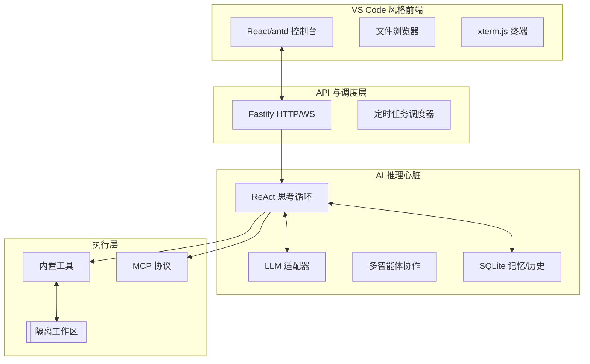

# 🚀 AI Agent Engine

AI Agent Engine 是一个具备**感知、思考、行动**能力的全栈 AI 智能体运行时引擎。它不仅是一个对话框，更是一个能够安全操作文件、运行命令、调用外部工具并协作完成复杂任务的数字化工作空间。

---

## 🌟 核心特性

- **🧠 强大的推理心脏**：内置 ReAct (Thought -> Action -> Observation) 循环，支持 DeepSeek V4 Flash/Pro/R1、Claude 3.7、GPT-4o、Qwen、Kimi k2.6/k2.5/k2-0905、Moonshot 等主流模型及其”思考模式”；未知 Provider 自动降级为 OpenAI-compatible 接口；自动检测第三方代理（OpenRouter/Groq/Together 等）并关闭不兼容特性。
- **🧠 语义记忆网络**：基于“三脑协同”架构（向量/关系/图）的长期记忆系统。支持“无感 AI 路由”意图识别，自动提取关键信息并建立跨会话关联（相似、矛盾、因果等），配合遗忘/衰减机制，让 Agent 真正具备“成长的灵魂”。
- **�🛠️ 丰富的工具系统**：
  - **内置工具**：文件管理、Shell 终端、网页抓取、图片解析 (`read_image`)。
  - **任务管理**：定时任务 (Cron) 及待办管理 (Todo)，支持 AI 自主排程。
  - **扩展能力**：支持 MCP (Model Context Protocol) 协议及自定义 TypeScript/Python Skills。
  - **流式工具参数**：工具调用参数以流式增量 (`tool_arg`) 实时展示，配合 Qwen/vLLM `<tool_call>` XML 回退解析，覆盖更多模型的工具调用语义。
- **🔐 可选鉴权**：`POST /auth/user` 接口支持外部平台用户同步（token + userId），携带凭据时自动验证并多租户隔离，不携带时降级为默认租户，零配置即可启动。
- **📂 隔离的工作区**：每个会话拥有独立的物理工作目录，支持 VS Code 风格的文件树管理、实时编辑及大文件上传 (100MB)。
- **🤝 多智能体协作**：支持 Parent-Child Agent 模型，自动拆解复杂任务并分发给专业子智能体。
- **🔌 开放协议支持**：完美适配 MCP (Model Context Protocol) 协议，支持通过 TypeScript/Python 编写自定义 Skills。
- **🛡️ 安全沙箱**：基于命令注入检测与 SSRF 防护的执行环境，配合审计日志确保操作安全。支持三种安全模式（安全 / 标准 / 完全访问），会话级切换，前端输入框可一键选择。
- **⚡ Superpower 模式**：四档能力档位（`off` 关闭 / `balanced` 均衡 / `methodology` 专家 / `max` 极限），默认 `balanced`，一键控制工具集、Token 预算倍率和方法论 Prompt 注入。前端增强模式下拉菜单支持简体中文 i18n 切换，聊天输入框可拖拽调整高度。
- **📈 可观测性**：详细的 Token 分类统计（系统提示词、RAG、工具结果等）及性能监控指标。
- **💎 增强交互**：聊天输入框支持拖拽缩放高度，增强模式下拉菜单（AI 图标 + 中文档位标签），Max 模式操作前二次确认防误触。

---

## 🏗️ 系统架构

系统采用分层解耦架构，通过 SSE (Server-Sent Events) 实现 AI 思考过程与执行状态的实时感知。



---

## ⚡ 快速开始

### 方式一：本地开发启动
```bash
# 1. 克隆项目并安装依赖
git clone https://github.com/project/ai-agent-engine.git && cd ai-agent-engine && npm install

# 2. 配置环境
cp .env.example .env 
# 请在 .env 中填入你的 LLM API Key
# OpenAI/Qwen/自定义兼容接口: OPENAI_API_KEY
# Anthropic/Claude:           ANTHROPIC_API_KEY
# DeepSeek:                   DEEPSEEK_API_KEY

# 3. 运行初始化并启动
npm run db:migrate && npm run dev
```
访问 [http://localhost:12323](http://localhost:12323) 开始体验。

### 方式二：Docker 容器化部署
```bash
docker-compose up -d
```

---

## 💡 核心概念

- **Agent (智能体)**：AI 的“大脑”，可配置性格、知识库及专属工具集。
- **Session (会话)**：与 AI 的一次完整交互过程，包含独立的上下文记忆。
- **Workspace (工作区)**：AI 的“办公桌”，所有的文件创建、代码编写及命令执行均在此隔离运行。

---

## 📖 交互示例

**任务：** “分析 `data.csv` 里的数据并生成一份报告。”

1. **上传**：通过控制台上传 `data.csv` 到工作区。
2. **思考**：AI 规划步骤：读取文件 -> 分析数据 -> 编写 Markdown 报告。
3. **行动**：
   - AI 调用 `read_file` 获取 csv 内容。
   - AI 自动进行逻辑推理，调用 `write_file` 生成 `report.md`。
4. **结果**：你在右侧文件树看到报告，并在编辑器中实时预览。

---

## 🛠️ API 概览

| 类别 | 核心端点 | 描述 |
|------|----------|------|
| **用户** | `POST /auth/user` | 外部平台用户同步/注册（白名单，无需鉴权） |
| **对话** | `POST /api/v1/chat` | 核心 SSE 流式交互接口 |
| **存储** | `/api/v1/memory` | 键值对形式的持久化记忆管理 |
| **工作区** | `/api/v1/workspace` | 文件上传、下载及目录管理 |
| **自动化** | `/api/v1/cron` / `/api/v1/todos` | 定时任务与待办事项管理 |
| **安全** | `/api/v1/security/mode` | 会话级安全模式切换（safe / standard / full-access） |
| **管理** | `/api/v1/agents` / `/api/v1/models` | 智能体配置与模型 Key 管理 |
| **SDK** | `agent-engine` npm 包 | Embedded / Remote 双模式，22 组 API namespace |

---

## 📚 进阶文档

- [系统架构详解](docs/docs/overview.md)
- [快速上手指南](docs/docs/getting-started.md)
- [内置工具列表](docs/docs/system-tools.md)
- [第三方集成 API](docs/docs/third-party-integration.md)
- [核心引擎 API 接口](docs/docs/api-spec.md)

---

## 📄 License

本项目采用 [MIT License](LICENSE) 开源。
