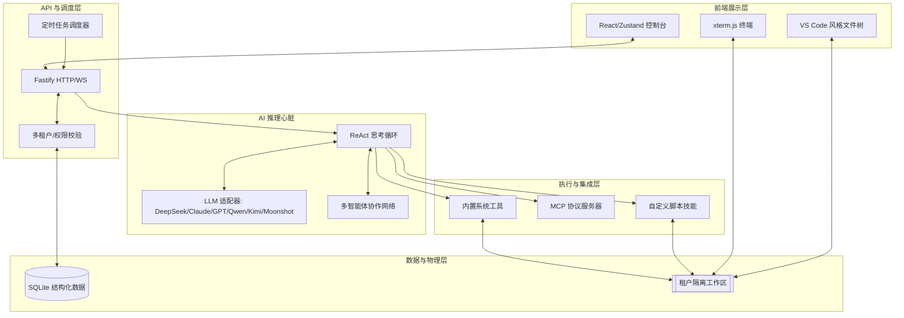

# Agent Engine 系统架构与模块关系网

本文档旨在帮助开发者和用户理解 AI Agent Engine 的内部构造，以及各核心模块之间是如何协作以提供强大的 AI 自动化能力的。

## 核心架构概览

AI Agent Engine 采用了典型的**分层解耦架构**，由后端 API 指挥、存储层支撑、ReAct 循环驱动推理、前端控制台提供实时交互。

---

## 模型支持矩阵

| 系列 | 模型 | 思考模式 | 视觉 | KV Cache | 备注 |
|------|------|:---:|:---:|:---:|------|
| **DeepSeek** | deepseek-chat (V3) | ❌ | ❌ | ✅ | 高性价比通用模型 |
| | deepseek-reasoner (R1) | ✅ | ❌ | ✅ | 深度推理，thinking/reasoning_content |
| | deepseek-v4-flash | ❌ | ❌ | ✅ | V4 系列轻量版，成本最低 |
| | deepseek-v4-pro | ✅ | ❌ | ✅ | V4 系列旗舰版，折扣至 2026-05-31 |
| **OpenAI** | gpt-4o / gpt-4o-mini | ❌ | ✅ | ❌ | 支持 image_url 视觉理解 |
| **Anthropic** | claude-sonnet-4 / claude-3.7 | ✅ | ❌ | ❌ | Claude thinking 模式 |
| **Qwen** | qwen-* | ✅ | ✅ | ❌ | 工具调用可能以 XML `<tool_call>` 回退 |
| **Kimi** | kimi-k2.6 / kimi-k2.5 / kimi-k2-0905 / moonshot | ❌ | ❌ | ✅ | 经 DeepSeek 兼容层接入 |
| **其他** | 任意 OpenAI-compatible 端点 | — | — | — | 自动降级，适配 normalizeBaseURL |

> **第三方代理自动检测**：当 baseURL 匹配 `openrouter.ai | groq.com | together.ai | fireworks.ai | perplexity.ai | novita.ai | moonshot.cn | api.lingyi.ai | api.302.ai | api-gw.* | gateway.* | proxy.*` 时，引擎自动跳过 `stream_options.include_usage`，避免不兼容代理返回 400/422 错误。`tool_choice` 默认设为 `'auto'`，确保大多数代理正确触发工具调用。

## 模型定价与成本监控

引擎内置 DeepSeek 动态价格模块 (`src/core/deepseek/pricing.ts`)：

- **本地持久化**：定价配置存储于 `~/.agent-engine/deepseek-prices.json`，首次启动自动写入默认值。
- **智能合并**：系统升级新增模型时，自动补全到现有本地配置，无需手动迁移。
- **折扣感知**：支持 `discountPrice + discountUntil`，到期自动切换回原价（如 deepseek-v4-pro 当前折扣价 3/6/0.025 元/百万 tokens）。
- **KV Cache 节省计算**：`cacheHitTokens × (原价 - 折扣价) / 1,000,000` 实时展示缓存节省金额。
- **API 动态更新**：`PUT /api/deepseek/prices` 可运行时修改定价，即时生效。

---

## 核心关系网分析：它是如何运转的？

### 1. 意图与执行的闭环：API $\leftrightarrow$ ReAct $\leftrightarrow$ Tools
- **后端 API** 是系统的指挥中心。当你发送一条消息时，API 会根据 **Agent 配置**（来自 SQLite）启动一个 **ReAct 推理循环**。
- **ReAct 循环** 是 AI 的“思考过程”。它通过“思考 (Thought) -> 行动 (Action) -> 观察 (Observation)”的循环来拆解任务。
- **工具 (Tools)** 是 AI 的手脚。无论是读写文件（Workspace）、查询数据库、调用 MCP 服务器，还是执行 Shell 命令，都是通过标准化的工具接口实现的。

### 2. 实时感知：SSE $\to$ 前端状态
- 系统使用 **SSE (Server-Sent Events)** 技术。AI 每产生一个“念头”或执行一个“动作”，后端都会立即推送到前端。
- **前端 Zustand Store** 像雷达一样捕捉这些信号，并实时更新 UI（如流式文字、工具执行动画、进度条），确保用户始终知道 AI 在做什么。
- **流式工具参数**：工具调用参数以 `tool_arg` 事件类型逐 delta 增量输出，前端可实时渲染"正在填写参数..."动画。兼容 Qwen/vLLM 等以 XML `<tool_call>` 文本块而非标准 JSON `tool_calls` 返回工具调用的模型。

### 3. 多智能体协作：SubAgents 关系网
- 系统支持 **Parent-Child Agent** 模型。一个复杂的任务（如“重构整个项目”）可以由一个主 Agent 拆分给多个专门的 **SubAgent**（如“代码审查专家”、“测试编写专家”）协同完成。
- 每个子 Agent 拥有独立的上下文，但共享同一个 **Workspace**，确保产出物的一致性。

### 4. 认知与记忆：三脑协同语义记忆网络 (Three-Brain Architecture)
- **三脑协同架构**：
  - **海马体 (向量数据库)**：提供语义直觉。利用 LLM 嵌入技术实现模糊匹配，捕捉对话中的“似曾相识”。
  - **大脑皮层 (关系型数据库)**：提供精确事实。基于 SQL 的分词模糊匹配，作为向量失效时的强力降级，确保核心词汇永不丢失。
  - **联络图 (图数据库模拟)**：提供高阶联想。通过 Edges (边) 自动激活关联节点，实现从“点”到“网”的认知扩散。
- **无感 AI 路由**：在检索前并行启动微型 LLM 分析用户意图。自动区分寒暄（NONE）、身份查询（IDENTITY）或业务问询，并智能扩展检索词阵列，整个过程与 RAG 并行，对用户零延迟感知。
- **自动提取与关联**：对话结束后异步提取关键事实、偏好和决策。支持 `reinforces` (强化)、`contradicts` (矛盾) 等多种逻辑关联。
- **记忆衰减**：模拟遗忘机制，根据时间、访问频率和重要度自动计算权重，确保存储空间的高效利用。

### 5. 开放协议：MCP 与 Skills
- **MCP (Model Context Protocol)**：允许系统接入外部数据源（如 GitHub、Google Drive）或外部工具。
- **Skills**：用户可以用 TypeScript/Python 编写自定义脚本，直接扩展 Agent 的能力。

### 5. 隔离与安全：多租户与工作区
- **可选鉴权**：请求携带 `X-API-Key` 或 `Authorization: Bearer <jwt>` 时自动验证；不携带则降级为默认租户 `"default"`，零配置即可启动。外部平台通过 `POST /auth/user` 同步用户 token，后续请求自动隔离。
- **多租户隔离**：每个用户（租户）的数据在数据库中逻辑隔离，在磁盘上通过独立的 **Workspace** 目录物理隔离。
- **业务订制化 (Tenant Config)**：
  - **专属身份**：支持租户级 `default_identity` 配置，自动为该租户的所有会话注入基础身份。
  - **业务透传**：通过 `metadata` 字段支持第三方系统透传业务上下文（如 `userId`, `traceId`），实现业务数据的闭环。
- **安全沙箱**：所有的 Shell 命令和网络请求都经过**安全策略引擎**的正则过滤和 SSRF 防护。

---

## 用户看得懂的“任务生命周期”示例

如果你对 AI 说：**“帮我写一个贪吃蛇游戏，并运行它”**，系统内部会发生什么？

1. **接收指令**：API 接收到请求，确认你的身份，并找到你当前的 Agent。
2. **制定计划**：AI 进入 ReAct 循环，第一步是“思考”：*“我需要先创建一个目录，然后编写 HTML/JS 代码，最后通过终端预览。”*
3. **执行行动**：
   - AI 调用 `create_dir` 创建工作目录。
   - AI 调用 `write_file` 写入游戏代码。
   - AI 调用 `run_command` 启动一个本地 Web 服务器。
4. **实时反馈**：你在前端会看到：
   - 聊天框里流出的“思考过程”。
   - 自动跳出的“工具执行卡片”。
   - 右侧 **Explorer** 里自动出现的新文件。
   - 下方 **Terminal** 里自动运行的命令输出。
5. **任务完成**：AI 告诉你游戏已准备好，你可以点击预览链接直接玩。

---

## 总结
AI Agent Engine 不仅仅是一个对话框，它是一个**具备感知、思考、行动能力的数字化工作空间**。通过将 AI 的推理能力与系统的物理操作权限安全地结合在一起，它能够像人类助手一样真正地“完成工作”。
