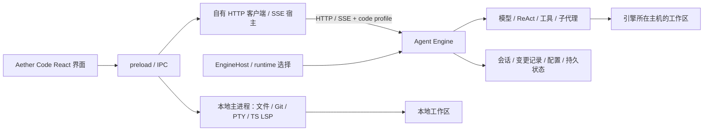

# Aether Code × Agent Engine：能力差距与联动升级深度调研

> 实施顺序更新：用户随后确认尚未发布、开发数据可清理、密钥可迁移。请以 [开发期最高收益任务安排](2026-09-29-development-priority-plan.md) 为后续执行计划；历史数据迁移、N−1四组合、在线更新和多平台发布已后置。本文保留审计事实与正式发布场景的完整要求。

审计日期：2026-09-29。实际消费方：`D:\dev\aether-code`（下称 F）；引擎：`D:\dev\ai-agent-engine`（下称 E）；比较对象仍是指定安装目录中的 Claude Code 2.1.266。

**结论：后续改进必须以“引擎 + Electron IDE”的完整产品为单位验收。当前链路已经可用，但不能把引擎单仓测试通过当作前端升级安全的证明。最需要先补的是运行版本可识别、数据与密钥不丢、协议不丢字段、历史与实时状态一致，以及四种新旧版本组合的发布门禁。**

这是研究交付，未修改两仓业务代码，也没有实施下述修复。执行了本地构建、隔离测试和探针；不读取生产会话或真实密钥，不调用付费模型。前端存在大量用户未提交工作且审计期间继续变化，所有结论限定本轮磁盘快照。

## 1. 本轮补足了什么

上一份 [Claude 对比报告](2026-09-29-aether-vs-claude-2.1.266.md) 侧重引擎与其附带控制台，没有审查实际 Electron 消费方。本报告修正产品范围，不把旧报告的历史行号、失败结果、已修复问题直接当作当前状态。

| 证据层 | 本轮范围 | 能证明什么 |
|---|---|---|
| 两仓源码 | main/preload/IPC/renderer → HTTP/SSE → 引擎执行与存储；启动/打包/版本/密钥；Git/LSP/PTY | 实际能力归属、字段流向、可达风险路径 |
| 实际注册路由 | 从 IDE 源码抽出 48 个调用点、37 个方法/路径模板，与真实 Fastify 实例匹配 | 48/48 均有路由；不代表 body、权限和 UI 语义全部正确 |
| 真实 Electron | 两仓先构建，再运行现有 subagent-lifecycle，单 worker、隔离 userData/端口、本地模拟模型服务 | 3/3 通过；真实引擎、工具、SSE、IPC、卡片、取消、重启与导出链路 |
| 数据探针 | 真实路由处理器 + SQLite + 全新虚构文件/模型 | 复现模型能力覆盖、撤回次序依赖、覆盖后续用户编辑、200 条返回上限 |
| 单元/集成验证 | 引擎 7 文件 75 用例；IDE pending/security/subagent 38 用例 | 引擎 75 过；IDE 37 过/1 失败，详见第 10 节 |
| Claude 证据 | 沿用前轮实际本地包：51 help、45 Input、94 个唯一静态命令名、33 Hook 事件 | H=帮助、T=类型、S=静态实现线索；未新增账号/云服务可用性验证 |

本轮 E HEAD：`770090dbd9f4857e6bb11c0d1ceef3db8c5b27d5`；F HEAD：`2c6a74a55f42d09f7751e1142382c361c51625e6`。两者版本号不能代替工作树身份，尤其 F 含未提交改动。文件指纹见 [两仓快照](aether-code-consumer-source-manifest.json)。

深入证据分为三份，避免把“源码里有”与“用户用得到”混在一起：

- [能力归属与工具/安全](2026-09-29-aether-code-capability-ownership.md)：Git、PTY、真 LSP、工作区、code profile、模型配置、文件回退。
- [HTTP/SSE/历史/审批端到端契约](2026-09-29-aether-code-wire-contract-audit.md)：全部聊天事件、请求字段、子代理与恢复路径。
- [宿主、打包、认证与联动发布](2026-09-29-aether-code-host-release-audit.md)：运行时选择、复用、数据、密钥、发布矩阵。

## 2. 真实产品架构：哪些东西由谁负责



本地嵌入模式下两边通常操作同一工作区；远程模式下这两个文件空间不再天然相同。

**F 没有依赖发布的 `agent-engine-sdk`。** 它使用自己的 `src/main/engine/client.ts`、`host.ts` 和内联改写的 `sdk/`。因此只修发布 SDK、只升级 SDK 包版本，不能修复这个消费者。应把主进程 HTTP/SSE、共享 IPC 类型和 renderer reducer 一并纳入契约审查。

| 能力 | 实际责任方 | 升级时应避免的误判 |
|---|---|---|
| 编辑器、文件树、文件操作、搜索 | F 本地服务与界面 | 引擎无同名 API 不等于产品没有 |
| Git 状态、分支、提交、暂存、stash、同步等 | F GitService + IPC + Git UI | 已有广泛人工 Git 工作流，不应重新在 E 复制一套；部分 diff/gutter 接入仍不完整 |
| 人工交互终端 | F node-pty/xterm | 不等于模型已拥有持久 shell、后台任务句柄或沙箱 |
| TS/JS 编辑器语言服务 | F 真正的 typescript-language-server stdio | 当前接了 hover/definition/references/completion，不能按完整 LSP 支持计分 |
| 模型诊断工具、CodeGraph | E；F 接诊断与索引 UI | 应与本地编辑器诊断统一展示，不能把两个来源相互替代 |
| 聊天/工具/子代理/模型配置 | E 执行，F 消费和展示 | 必须贯穿 HTTP → main → IPC → reducer → 历史 |
| 文件改动卡、保留/撤回/暂存 | E 快照/回退 + F diff/交互/本地 Git | 已有 UI；仍缺冲突检测、有序批量回退和完整工作区 checkpoint |
| 引擎启动、升级、退出、密钥 | F EngineHost/runtime/secrets | 这是前端宿主的发布责任，不能只改 E/server |
| General 模式记忆/任务/Cron/管理面 | E 平台 | 当前 code 模式不会自动提供给 IDE 的模型或界面 |

详见 [能力归属矩阵](2026-09-29-aether-code-capability-ownership.md)。

### 2.1 IDE 当前真正暴露的模型工具

普通 HTTP 与 SSE 都设置 `X-Aether-Tool-Profile: code`。E 以请求为单位限制注册集合，当前 22 个内置工具如下，另可加入满足规则的 skill/MCP 扩展：

```text
read_file       write_file       list_files       delete_file       create_dir
glob_search     grep_search      execute_cmd      code_diagnose     codegraph
subagent        todo_list        todo_create      todo_update       todo_delete
list_skills     get_skill        run_skill_script
web_fetch       http_request     ask_user         get_current_context
```

代码依据：[E/tool-profile.ts](/D:/dev/ai-agent-engine/src/tools/tool-profile.ts:20)、[F/tool-profile.ts](/D:/dev/aether-code/src/main/engine/tool-profile.ts:2)。

已修复或应纠正的旧判断：

- `run_command/glob/grep/smart_read` 已在配置入口归一化到正式名称；`allowedTools` 与 profile 求交集，空数组确实禁用工具。旧报告 G10 的名称错配部分已修复，审批之后仍被旧白名单拦截是另一段未闭合逻辑。
- profile 已进入 chat、messages、Flow、subagent；不能再说“Flow 没传 profile”。Flow 的身份/cwd 等其他字段仍需分别检查。
- code 排除 `cron_* / agent_* / task_*` 管理工具、长期记忆工具、npm 辅助工具、calculate/get_time，并跳过自动长期记忆召回/提取/inline memory。不能拿 E general 的记忆能力直接算 IDE 优势。
- code 是工具选择机制，不是 OS 沙箱、管理 API 的授权机制，也不保证任意脚本不能执行被排除的活动。
- 新旧两套子代理取消路由都存在；未发现“旧取消接口 404”问题。
- F 新启动的 embedded 引擎强制监听 `127.0.0.1`；独立 E 默认 `0.0.0.0` 不应直接套到这个场景。adopted/remote 实例另算。

## 3. 放到真实 IDE 后，与 Claude 的差距怎么变化

“组合产品已有”仍区分实际执行、仅有 UI/API、及本轮是否验证。Claude 各项保持 H/T/S 证据等级，不能把二进制定义当成账号已启用；完整枚举见 [Claude 全目录](2026-09-29-claude-capability-catalog.md)。

| 能力组 | E + F 的当前情况 | Claude 2.1.266 本地证据 | 实际应追赶的差距/责任 |
|---|---|---|---|
| 多模型选择与配置 | 主/子/轻任务模型 UI，E 多供应商 adapter | H model/effort、账号模型体系 | 保留跨供应商定位；E adapter 正确性 + F 无损能力编辑 |
| 自主工具循环 | E ReAct 与真实工具；F 完整聊天基础 | T 工具、S 运行循环 | 预算、批次终态、审批、恢复质量；不能用工具数比较任务成功率 |
| 文本/思考/工具进度 | 思考/工具参数可增量；根正文仍整段缓冲后模拟流式，恢复有缺口 | H stream-json、partial messages | E 增量生成 + F 顺序/去重/终态一体升级 |
| 上下文/压缩 | E JSONL/摘要；F 用量和压缩入口 | H context/compact、S 相关机制 | E 摘要与完整请求预算；F sessionUsage 和压缩状态接入 |
| 文件读写/搜索 | code 工具有实现；F 有编辑器/搜索 | T Read/Write/Edit/Glob/Grep 等 | 仍缺精确 edit/patch、冲突检测；新增工具要更新显示/跳转/改动事件 |
| 命令与人工终端 | E execute_cmd + F 真 PTY | T Bash 与后台任务、H 后台管理 | 人工终端已具备；模型持久 shell/后台句柄/恢复单独建设 |
| Git 人工操作 | F 本地 Git 服务与丰富 UI | H worktree/from-pr，S Git 工作流 | 无须重复 Git CRUD；补 Agent 隔离、worktree 管理、审查/PR关联 |
| 编辑器语言服务 | F 真 TS LSP，四类 provider | T LSP 与 H IDE 连接 | 补 provider/诊断/取消生命周期；Agent 语义工具是另一条需求 |
| 差异审查/撤回 | F diff/keep/revert/stage；E 逐操作快照 | S rewind/checkpoint | 先修数据一致性，再做文件历史/工作区快照；不等价于撤回外部副作用 |
| 子代理 | 持久 run/event/outbox、取消、独立卡片；本轮真实 E2E 通过 | T Agent，H agents/attach/logs 等 | 当前成果保留；补 detach/wait/mailbox/followup、工作树隔离与 durable root run |
| 计划模式/目标 | 方法论与 Todo；无完整强制只读计划态 | T Enter/ExitPlanMode、ProposeGoal | E 执行状态机 + F 模式、验收与批准入口 |
| 提问与权限 | 实时单题/审批可接；重启恢复不足 | T Ask/Plan，H 权限选项 | pending 持久契约、批准后可执行、未知事件不能静默当成功 |
| 会话/历史 | F 切换、删除、重试、截断、导出 | H resume/continue/fork | 先修稳定 message/turn ID；再加 fork 与运行恢复 |
| 安全/沙箱 | E 策略/模式；F 有管理页 | H permissions/sandbox，S Windows 等机制 | 统一实际副作用入口；UI 准确表达路径权限；OS 隔离需另验 |
| Skills | E 加载/脚本；code 可调用 | H skills/plugins、S 生命周期 | F 管理/信任/状态入口未闭合；脚本执行仍须统一策略 |
| MCP | E 工具接入；F 可间接调用已配置扩展 | H stdio/HTTP/OAuth，T resources 等 | E 标准协议/生命周期 + F 登录、资源、配置、状态和错误交互 |
| Hooks/复合插件 | 未见等价完整产品 | S 33 Hook 事件，H 插件/评测 | E 受控扩展协议 + F 安装/启停/审批/日志；避免只加后端入口 |
| 浏览器/计算机交互 | 未见当前 IDE 的原生受控浏览器链 | H Chrome，T/S 浏览器与条件服务 | 独立产品项目；权限与页面状态协议先定义 |
| 多模态与文档 | E 部分工具/adapter；F 附件传路径、文件预览 | T 多种文件/图片入口 | 按 provider 和格式验收；remote 路径不能沿用本地假设 |
| 长期记忆 | E general 有；IDE code 默认关闭 | H/S memory；T 项目记忆 | 产品策略差异；若启用需用户控制、范围、来源、删除和迁移 |
| RAG/知识 | E 平台有；聊天 hook 未提供请求级知识绑定 UI | T Projects search 等条件服务 | 修范围约束后决定是否进 IDE；不算已交付的 IDE 知识管理 |
| Flow/Cron/任务 | E general 平台；IDE 无完整管理消费 | T Workflow/Cron/Monitor/ScheduleWakeup | 当前 IDE 优先级较低；未来要同时交付运行状态/取消/身份/持久恢复 |
| 远程开发 | F 能连接远端 HTTP；本地文件/Git/LSP不迁移 | H remote-control/cloud/teleport | 缺认证、执行主机/文件映射/同步/隔离；不能只加 remote URL |
| 安装/升级/诊断 | F 能解析 runtime，闭环与握手不足 | H install/update/doctor | E 制品 + F 安装器 + 数据迁移共同负责，当前重要前置项 |
| Artifacts/云审查/推送/语音等 | 未见完整同等产品 | H/T/S 条件功能 | 依产品需求排序；不是为了表格齐全先建设的基础项 |

这轮没有进行同模型、同仓库、同预算的任务竞赛，因此没有“追平百分比”“快几倍”等性能结论。

## 4. 实际消费接口与事件：升级前必须看这张清单

### 4.1 48 个调用点覆盖的 37 个方法/路径模板

下表路径省略实际 `/api/v1` 前缀。`:id` 是静态分析中的模板占位，不代表实际请求写了占位字符串。

| 消费域 | 当前方法/路径 | 两边共同保持的语义 |
|---|---|---|
| 聊天 | POST `/chat`、`/chat/cancel`；GET `/chat/status`、`/chat/stream` | 同一 session/run 的启动、订阅、恢复、取消；断 SSE 不等于任务停止 |
| 历史 | GET `/conversation/history`、`/conversation/sessions`；POST `/conversation/compress`、`/conversation/truncate`；DELETE `/conversation/history`、`/conversation/turns/:id`、`/sessions/:id` | message/turn 身份、排序、分页、删除范围、压缩后的上下文 |
| 改动 | GET `/changes`；POST `/changes/:id/keep`、`/changes/:id/revert`、`/changes/keep-all`、`/changes/keep-many` | 每条快照/文件/轮次的关系、冲突、批量顺序、失败是否部分完成 |
| 模型 | GET `/models`、`/models/capability-defs`；POST `/models`、`/models/:id/test`、`/models/detect-capabilities`；PUT/DELETE `/models/:id` | 能力推断与人工覆盖区分；未编辑字段不丢；业务失败准确显示 |
| 安全 | GET/PUT `/security/mode`；GET `/security/policies`；PUT/DELETE `/security/policies/:id`；POST `/security/policies/reset` | 会话/全局范围、角色权限、真实权限变化、跨会话竞态 |
| 子代理 | GET `/subagent/runs`、`/subagent/runs/:id`；POST `/subagent/runs/:id/cancel`、旧 `/subagent/cancel` | schemaVersion、seq、parent/session/toolCall 归属与终态 |
| 代码与辅助 | GET `/codegraph/status`；POST `/codegraph/index`、`/lsp/diagnose`、`/utility/chat` | 文件属于哪台主机、取消、不可用状态、模型身份和费用 |

另有宿主直接调用根路径 `/health`、`/meta`；它们不在这 48 个 AST 请求对象里。动态路径和请求 body 也不由路由存在性检查证明。

[调用点与行号 JSON](aether-code-route-contract.json) 保存逐条结果；[实际路由注册树](engine-registered-routes.txt) 可以复核间接注册。当前没有把上述静态集合中的路径拼错列为问题。

### 4.2 请求字段与事件不能只看 TypeScript 同名

普通聊天发送 message/sessionId/agentId/model/workspacePaths/thinkingMode/subagentModel/utilityModel/attachments；交互续跑发送 toolResponse 和当前模型/工作区等设置。attachments 以文件名/路径传入，不是统一上传内容。skills/mcpServers/inline* 等引擎字段并没有被正常聊天 hook 全部透传，不能按后端 schema 宣称产品已接入。

| 事件/字段 | 当前消费状态 | 新增/修改时的要求 |
|---|---|---|
| content、thinking | 实时追加 | 持久水位、去重、重连、最终落库一致 |
| toolStart/toolCall/toolArgs/toolEnd/toolResult | 大体接通，按调用 ID 合并 | 稳定 canonical tool name；完整状态与 fallback 文本；普通工具 outputPreview/duration 不应丢 |
| ask_user / permissionRequest | 实时可交互 | 稳定 request ID、持久等待态、应答幂等、单/多题 schema 协商 |
| usage | 实时和部分历史可用 | 保留会话总量 metadata；别把 assistant message ID 当 turn ID |
| todo / fileChange | 实时可见 | 静止历史也要恢复；fileChange 独立面板已可补拉，不能笼统说全部丢失 |
| subagentEvent | v1 严格校验、seq/归属检查、REST 恢复 | 保留现有保护；v2 发布前先完成协商，否则旧 F 会丢弃结构化状态/详情，卡片可能降级或失去更新 |
| userMsgId / toolCall.messageId | 未回填到实时消息身份 | 必须消费，否则破坏性历史操作不能精确定位 |
| SSE id | main parser 丢弃 | 透过 IPC 到 renderer，只有成功应用后才推进客户端游标 |
| envelope.metadata | main HTTP 解包丢弃 | shared types + main return + renderer 三处同步 |
| error / done | 有实时错误处理；普通历史倾向 done | transport end 与业务 succeeded/failed/cancelled/waiting 分离 |
| messageBlock / flow | 共享类型有声明，主聊天未消费 | 先确认真实 producer/专用 UI；声明不能算交付能力 |

完整 producer→consumer 行号矩阵见 [协议附录第 3 节](2026-09-29-aether-code-wire-contract-audit.md)。

## 5. 最重要的兼容性与数据问题

下列 P0 表示启用相应升级/共享部署场景前必须阻断的风险；P1 是当前真实用户路径的正确性问题；P2 是能力完整性/可观察性问题。不是漏洞严重性评分。V=本轮动态复现；S=源码可达链推导；R=未来协议变更风险，尚未发生。

| ID | 优先级/证据 | 触发与后果 | 两仓处理要求 |
|---|---|---|---|
| C01 运行版本不可确认 | P1，V+S | 首选端口健康就采用旧进程，早于 desired runtime 解析；“重启”可能再采用同一旧进程。`/meta` 在 dist cwd 返回 unknown | E 从制品读 build/version；F 先协商实例/能力再 adopted，显示实际来源与版本 |
| C02 数据与安装目录重叠 | 升级启用前 P0，S | DB 在 `engine/<version>/data`；切版本可能看似丢历史；修复安装删除同目录可能删 DB。安装函数当前未接通，属于潜在升级风险 | F 稳定数据根、独立版本 runtime、迁移/备份/回滚；E 声明数据 schema |
| C03 旧密钥可能被替换 | P0，S | 已有 encrypted key 但 safeStorage 临时不可用，代码落入生成新 key 并覆盖旧文件，旧模型凭证失去解密能力 | F 保留原文件，明确恢复错误；不能把密钥不可用当首次启动 |
| C04 认证收紧后消费者无身份 | 共享部署 P0 / 升级 R | F 普通 HTTP/SSE 无 JWT/API key 配置；E 当前无凭据仍 default。仅把 E 改成强制拒绝会使现 F 失联 | 两边同时建立本机/remote 身份方案；全部 HTTP、SSE、resume、cancel 共用认证 |
| C05 SSE 恢复水位错误 | P1，S | F 丢 SSE id，再用 `/chat/status` 的服务端最新 ID 恢复；未落历史的 thinking/args 会跳过，status/history 间又可能重复 | E 快照附原子水位；F 按已应用游标恢复/去重；不能简单改成无游标全量回放 |
| C06 消息身份错位 | P1，S | 实时生成 UUID，不接 userMsgId；找不到 ID 时按正文第一条匹配。“继续”出现两次时可能删/截断第一轮 | E 定义 message/turn/run ID；F 回填身份，破坏性操作禁止正文 fallback |
| C07 提问/审批不能完整回放 | P1，S | 历史未投影 pending，普通未完成工具默认 done；切会话/重启后可能没有应答入口 | E 持久化 pending/answered 与批准上下文；F 重建等待状态，答案幂等 |
| C08 文件撤回不保证原点 | P1，V+S | A→B→C 两次快照，撤回按旧→新到达最终 B，按新→旧才 A；后续用户编辑被覆盖而无冲突；201 条只返回 200 | E 有序批量回退+内容版本检查+完整范围；F 展示范围/冲突/部分成功，不并发同文件逐条恢复 |
| C09 模型编辑丢未知能力 | P1，V+S | F 保存时只提交 vision/thinking，E 整体替换；只改显示名也会丢 contextWindow/parallelTools/toolCalling 等 overrides | 定义 PATCH/清空/自动语义，F 只提交改动字段；E 保留未涉及 override |
| C10 权限语义不同步 | P1，S | standard 已允许工作区外路径，但 F 只对 full-access 警示；safe 的批准仍可能被旧白名单拒绝 | E 输出真实权限维度、统一批准与执行；F 精确显示风险和批准结果 |
| C11 跨会话安全缓存竞态 | P2，S | A 请求中切 B，B 复用全局 inflight，A结果被丢后B未发请求；旧失败可能回滚新会话UI | F 按 session/request generation 隔离；未知不能假装 safe |
| C12 字段和终态静默丢失 | P2，S | main 丢 metadata；toolEnd outputPreview 缺失；审批原卡可能长期 running，历史又默认成功 | 两仓完善 envelope/工具 outcome；明确未知/取消/等待，不靠 done 猜成功 |
| C13 remote 文件空间不一致 | 启用跨主机前 P1，S | 模型在远端读写，F 本地 Git/LSP/附件仍用本地路径；Windows 路径也无法自然成为 Linux 路径 | 工作区 ID + execution host + 根映射/文件同步协议；不支持时禁用相应入口并解释 |
| C14 新协议被旧端静默接受/丢弃 | P1，R | 旧 E 忽略 code header 可能扩大工具面；旧 F 拒非 v1 子代理快照；questions-only 又可能被 permission 别名覆盖 | 协商 profile/schema/features；未知关键控制事件显式报不兼容，不能默认 general 或成功 |
| C15 LSP 接口与产品呈现不全 | P2，S | 只接四类 provider，关闭部分 Monaco 内置能力未补齐；markers/Problems 两套；请求/退出清理缺超时取消 | F 补 provider/lifecycle/诊断汇聚；E Agent LSP 工具独立设计 |

关键定位：

- C01：[F host.ts:149](/D:/dev/aether-code/src/main/engine/host.ts:149)、[E metrics.ts:15](/D:/dev/ai-agent-engine/src/api/http/routes/metrics.ts:15)；动态 [route probe](aether-code-route-probe.txt)。
- C02/C03：[F runtime.ts:48](/D:/dev/aether-code/src/main/engine/runtime.ts:48)、[runtime.ts:139](/D:/dev/aether-code/src/main/engine/runtime.ts:139)、[secrets.ts:40](/D:/dev/aether-code/src/main/engine/secrets.ts:40)。
- C04：[F client.ts:52](/D:/dev/aether-code/src/main/engine/client.ts:52)、[host.ts:411](/D:/dev/aether-code/src/main/engine/host.ts:411)、[E auth middleware:27](/D:/dev/ai-agent-engine/src/auth/middleware.ts:27)。模型 API key、数据库 ENCRYPTION_KEY、引擎 HTTP 身份是三种不同凭证。
- C05/C06/C07：[F host.ts:521](/D:/dev/aether-code/src/main/engine/host.ts:521)、[useChat.ts:660](/D:/dev/aether-code/src/renderer/src/core/engine/useChat.ts:660)、[useChat.ts:805](/D:/dev/aether-code/src/renderer/src/core/engine/useChat.ts:805)、[chat-history.ts:237](/D:/dev/aether-code/src/renderer/src/core/engine/chat-history.ts:237)。
- C08：[F ChangesPanel.tsx:194](/D:/dev/aether-code/src/renderer/src/contrib/chat/ChangesPanel.tsx:194)、[E changes.ts:42](/D:/dev/ai-agent-engine/src/api/http/routes/changes.ts:42)、[ChangeStore:124](/D:/dev/ai-agent-engine/src/storage/changes/index.ts:124)。
- C09：[F ModelFormDialog.tsx:199](/D:/dev/aether-code/src/renderer/src/contrib/models/ModelFormDialog.tsx:199)、[E models.ts:145](/D:/dev/ai-agent-engine/src/storage/sqlite/models.ts:145)。
- C08/C09 动态证据：[JSON](aether-code-data-contract-probe.json)、[日志](aether-code-data-contract-probe.txt)、[可复核脚本](audit-consumer-data-contracts.ts)。探针刻意控制到达顺序，证明顺序依赖，不声称已测出真实网络并发错误发生率。
- 其他项的完整触发链和行号见三份附录。以上不表示每个静态风险都已在真实 UI 故障注入中复现。

模型能力的修复尤其要谨慎：当前 GET `/models` 会合并推断后的能力，因此“把返回的全部能力原样保存”也可能把动态默认值固化为人工覆盖。更稳妥的是 E 分离 `resolvedCapabilities` 与 `capabilityOverrides`，F 只 PATCH 用户明确修改的 override；清除一个 override 与显式 false 要有不同表示。

## 6. 上一轮 G01–G18：哪些能引擎内部修，哪些必须联动

本表是改进归属与回归面，不宣称已经再次动态复现每个旧问题。未列 V 的旧逻辑以源码复核和前轮证据为依据；code profile 只改变产品可达范围，不代表 general 平台缺陷已修复。

| 旧编号 | 当前处理口径 | E 改进与 F 配套要求 |
|---|---|---|
| G01 摘要/provider | 编码聊天相关 | E 内部修复可保持 wire；F 验历史/压缩显示、同会话多 provider 长任务 |
| G02 鉴权/监听/角色 | embedded loopback 已由 F 保证；无身份问题仍在 | **必须联动**认证、握手、401/403、模型/策略管理权限；不可只关闭匿名 |
| G03 副作用策略 | code 移除 npm 辅助工具，但 skill/MCP/web 路径仍相关 | E 统一策略；F 接新的批准类型、原因、范围和恢复状态；扩大批准不能静默默认 |
| G04 批次执行/终态 | code 并行工具仍相关；observer 取消/结束记账已有改善，但整批执行后提前 return 仍可能漏主会话/SSE结算 | E 执行屏障/持久终态；F 按工具 ID 处理 waiting/skipped/cancelled/failed，别只看一轮 done；不泛称所有通道记录都丢 |
| G05 Flow 上下文 | profile 已传递；其他 cwd/身份/权限仍未完全贯穿；F 无直接 Flow UI | E general 修复；未来接入 F 时用同一 ExecutionContext，不把它当当前主聊天已缺失 |
| G06 KB/terminal/task 归属 | code chat 仍可进入 RAG，知识绑定分支未做 ID 过滤；F PTY 是自有服务，code 不提供通用 task 管理工具 | E 修知识范围与平台资源归属；不能因无知识管理UI就忽略RAG执行范围，也不能宣称修 E terminal 就修了 F 的人工终端 |
| G07 完整上下文预算 | 累计请求预算已增强：计入 messages/system/tools、输出和总结/finalization预留；不应照搬旧“全遗漏” | 剩余 context-window 检查仍以 historyTokens 为主，压缩失败/JSONL无maxTokens兜底需极限验收；F 回归用量/错误/压缩与恢复 |
| G08 fallback | 主聊天相关 | E 修流前/流后边界；F 展示真实模型/失败/用量，回归无重复文本或副作用 |
| G09 真正文流式 | 用户体验直接相关 | **联动验收** delta、tool ordering、重连去重、历史最终一致性 |
| G10 工具名/批准 | 名称归一化已修；批准后旧白名单限制仍在 | 不再重复修名称；E 修批准执行一致性，F 覆盖已批准命令真实执行与旧卡终态 |
| G11 LSP 限流/结果 | E diagnose 与 F 真 LSP 是两套 | E 修 Agent 诊断执行；F Problems 统一来源、unsupported 显示；不要重写已有 LSP |
| G12 Ollama 能力 | F 可配模型，仍需面对 adapter 实现差异 | E 能力求交；F 修 C09 并按 resolved capability 控制附件/工具/上下文显示 |
| G13 queue/Cron | code 工具面不提供，F 无管理闭环 | E general 后续路线；新接入时才同步运行面板/身份/重试/取消，不挡当前 IDE coding 基线 |
| G14 指标 | 聚合 metrics 未接主链；已有 request attempt、子代理 usage、F token 显示，不能说全部计数都缺 | E 补聚合埋点；F 消费 session/run 成本并保留 metadata；避免计两次 |
| G15 发布 SDK | F 不消费发布 SDK | SDK 修复独立有价值；**F 自有 client/host 必须单独修和测** |
| G16 会话存储并发 | F 编辑/重试/删除/压缩都可触发 | E session 写入序列/租约；F 版本冲突提示、禁错轮身份、并发操作验收 |
| G17 长期记忆 | code 默认跳过自动长期记忆 | 不算当前 IDE 主链优势或阻断；general 修复独立推进 |
| G18 checkpoint/revert | F 已有完整可点击入口，风险更直接 | **必须联动** C08；E 返回冲突/批量范围，F 可审查、有序提交、准确呈现部分失败 |

“内部修复可保持 wire”仅表示无需为新增字段强制同步发版，仍需跑真实消费者回归。任何改变失败形态、权限、时序、持久化或工具名字的改动都应重新分类。

## 7. 建议建立的稳定契约（尚未实现）

### 7.1 先知道连接到了谁、支持什么

扩展 `/meta` 或提供专门 capabilities 端点，旧字段保留。以下是设计建议，不是当前 API 已存在的字段：

| 契约组 | 建议表达的信息 | 前端用途 |
|---|---|---|
| 制品与实例 | engineVersion、buildSha/artifactDigest、instanceId、runtime source | 验证运行的是目标构建，识别 adopted/owned/remote |
| 协议 | API 版本范围、stream 协议版本、subagent/pending/tool schema 版本集合 | 选择共同版本；无交集时明确不兼容 |
| 产品能力 | 支持的 toolProfiles、实际生效 profile、features/canonical tools | code 未生效不能静默使用 general；按能力开放入口 |
| 身份与权限 | auth schemes、当前会话身份/角色、effective permissions | main 加凭据，UI 显示真实权限，避免把模式名当全部语义 |
| 文件空间 | executionHostId、workspaceId、根映射、路径格式、文件传输能力 | 区分远程模型文件与本地文件，避免本地 Git 操作错目标 |
| 数据兼容 | dataSchemaVersion、可读/可写/迁移范围 | 升级前判迁移，降级前判能否安全读取 |

公开握手只返回必要身份摘要，不能暴露原始凭据或数据库私有路径。版本号负责标识，feature/schema 负责具体协商，二者不能互相代替。

### 7.2 稳定的数据形状与状态机

1. **HTTP 信封**：固定业务 code/message/data/pagination/metadata；明确 HTTP 401/403 与业务失败。保留未知可选字段，未知关键状态显式报错。字段省略/空数组/null/false 的更新语义写进 schema。
2. **事件信封**：eventId、runId、sessionId、turnId/messageId、type、schemaVersion、payload。main 解析不得丢控制字段；renderer 应用成功后记水位。历史快照与恢复游标来自同一一致性边界。
3. **运行终态**：succeeded/failed/cancelled/interrupted/waiting 分开；SSE done 只是传输结束。工具、根运行、子运行都可通过持久状态重新投影。
4. **交互请求**：pending 有 requestId、toolCallId、原始输入、原因、状态、产生时模型/工作区/权限上下文；应答幂等。改变工作区或模型后续跑的规则必须明确。
5. **文件变更**：稳定 change/operation ID、workspace/file identity、前后版本/hash、受影响范围；批量回退在 E 排序/锁定，不依赖浏览器并发顺序。事务失败和不可回退的大文件要返回可解释结果。
6. **模型能力**：推断值、adapter 实际支持、人工 override、产品环境限制分开；最终值求交或按明确优先级计算，旧 F 不得覆盖新 E 的未知字段。

跨仓可以提取轻量 protocol 包或生成 JSON Schema/TS 类型；不必强迫 F 引入整个启动 SDK。共享类型仍不能取代真实 producer→main→IPC→reducer→UI 的测试。

### 7.3 有兼容窗口的发布次序

1. E 先提供后向兼容的握手与可选字段，保留现有路径/信封；记录旧消费者使用情况。
2. F 加入协商、完整透传、已消费游标、pending/终态恢复，以及明确的不兼容提示；当前功能仍可走旧版协议。
3. 两边都支持后才启用新 schema、强制认证和新交互流程。认证收紧作为配对迁移，不能以兼容为由永久保留远端匿名管理。
4. 新能力通过 capability 启用；旧 F 不认识的新关键控制事件不能静默发过去。工具集合扩大必须是显式产品选择。
5. 发布配对 manifest，包含 E/F 版本范围、制品 hash、平台、数据迁移与回滚限制；达到约定兼容周期后再撤旧契约。

## 8. 用户数据与运行时交付：先解决“更新之后到底跑了什么”

F 当前顺序是：**先尝试 adopt 首选端口 → ENV entry → userData 已安装 → resources 内置 → sibling dist → 旧 SDK 副本**。仅 `npm run build` 不保证下一次应用启动就运行该 dist。

当前 `DEFAULT_ENGINE_VERSION=1.0.0` 用于安装/数据槽位，E package 为 2.0.0；这不直接证明启动错版，却证明没有统一制品身份。动态探针已复现 `/meta` 在 E 根目录返回 2.0.0、在宿主常用的 dist cwd 返回 unknown。

打包层也尚未闭合：`electron-builder.yml` 未配置引擎 extraResources/复制 hook，resources 中没有引擎资源；`installFromTgz` 只有定义而无安装入口调用。开发机 sibling fallback 能运行，不证明用户安装包能在干净机器运行。

建议将用户数据放到独立且不随 runtime 版本变化的稳定根目录，runtime 放在可替换的版本目录；数据库、JSONL、附件/工作区索引与密钥都须明确所有者和迁移范围。更新器只替换 runtime，备份/迁移有独立状态和失败恢复。若新 schema 不能被旧版读取，应明确禁止直接降级或执行经过验证的回滚，不能把旧二进制切回来就称为回滚成功。

adopted 进程必须显示为外部实例，其 stop/restart 语义与 owned 进程不同；升级时验证 instance/build/数据身份。不能未经区分停止用户其他常驻服务，也不能无声复用旧服务制造升级成功的假象。

## 9. 防止“引擎更新，前端跟不上”的发布门禁

### 9.1 四个版本组合必须分别验收

N-1 指实际上一发布制品，不能用当前源码加一个旧版本字符串代替。

| 前端 | 引擎 | 必须结果 |
|---|---|---|
| N-1 | N-1 | 固定已发布基线，留存数据/消息/事件夹具 |
| N-1 | N | 既有功能不变；required schema/auth 不兼容时有明确升级路径；不得静默丢审批或扩大工具 |
| N | N-1 | 按真实能力降级；code profile 或必要安全契约缺失时阻止相关执行并解释，不能默认能力存在 |
| N | N | 新能力完整闭环，重启/断线/取消/失败同样通过 |

### 9.2 从协议夹具到真实安装包

| 验收层 | 必须覆盖 | 谁负责 |
|---|---|---|
| Schema/协议夹具 | 从真实 E 输出采集成功、业务失败、401/403、工具/审批/子代理/未知事件；F 从 main parser 一直送到 reducer | 两仓共同维护 |
| 请求覆盖 | HTTP 与 POST SSE、GET resume、cancel 同一认证/profile/workspace；body、省略/null/false 更新语义 | E route + F client/host |
| 状态恢复 | 断网在 thinking/toolArgs/pending/工具副作用之后；重复事件、乱序、重启、已完成缓冲、重复正文消息 | E runtime/storage + F history/reducer |
| 数据正确性 | A→B→C 回退、人工后改、>200 变更、仅改模型名、安全模式快速切换 | 两仓；不得只做 UI 快照 |
| 真实 Electron | 两边构建，专用端口/userData；断言实际 entry/build 与 adopted=false，再验聊天/审批/工具/取消/历史 | F E2E，E 提供本地可控 provider 夹具 |
| Runtime 来源 | env、installed、bundled、dev、adopted、remote 各自验证，不共用“能聊天”代替 | F host/runtime |
| 正式制品 | 无 sibling repo、无开发 node_modules 的干净环境，目标 OS/架构；runtime/native依赖/技能/assets齐全 | E 制品 + F electron-builder |
| 迁移/恢复 | 旧数据建库→升级→打开；损坏 runtime 修复；safeStorage临时失效；支持范围内降级 | 两仓发布流程 |

F 的 `pretest:e2e` 只构建 F，不构建 E。联动 CI 必须显式构建两边，并保存 source hash、runtime artifact digest、实际启动 snapshot/握手。遵守 F/AGENTS：Electron `workers=1`；不能用旧 out 验新源码。

新增工具、MCP OAuth、Hooks、后台命令、worktree、会话 fork、远程执行等需求，必须同时有消费者任务：入口/状态、批准、结果、错误、取消、历史、能力不支持时的降级。可以没有专门 UI，但必须证明通用 UI 足以表达其语义。

### 9.3 建议落地顺序

| 顺序 | 交付内容 | 完成标准 |
|---|---|---|
| 1 | 制品/实例/能力握手、稳定数据根、旧密钥保护、正式打包入口 | 干净安装可启动；升级明确跑新制品且旧数据/密钥完整；错误 runtime 不会无声 adopted |
| 2 | C08 文件回退、C09 capability 更新、C06 消息身份、C10 权限语义 | 真实 UI 操作不丢文件/配置、不截错轮次；批准结果与执行一致 |
| 3 | SSE 水位、pending 持久恢复、根工具 outcome、metadata | 断线/切换/重启后状态一致，不丢审批、不重复副作用 |
| 4 | 认证与 remote workspace 配对升级 | HTTP/SSE/恢复/取消同身份，模型与本地工具操作同一明确工作区 |
| 5 | 真流式、预算/fallback、精确编辑、LSP/诊断补齐、后台命令/worktree | 以固定真实编码任务回归验证成功率、时延、取消/恢复；保留两仓兼容门禁 |
| 6 | MCP 完整协议、Hooks/插件、持续协作与按需平台功能 | 后端能力、宿主流程、安装/信任、日志、恢复均有验收；按产品范围逐项启用 |

不同部署可调整先后：只在本机研究时 remote/共享部署项可后置；一旦开放远端或自动升级，相应前置项必须先完成。不承诺未经估算的追平时间。

## 10. 本轮实际验证与明确边界

| 检查 | 结果 | 证据 |
|---|---|---|
| E typecheck | 通过 | 本轮执行；后续 E build 也通过 TypeScript 编译 |
| F 最新 typecheck | node/web 均通过 | [最新日志](aether-code-typecheck-latest.txt) |
| E build | 通过 | [构建日志](consumer-engine-build.txt) |
| F build | typecheck + Electron main/preload/renderer 构建通过 | [构建日志](aether-code-build.txt) |
| E 目标测试 | 7 文件 / 75 passed | [测试日志](consumer-engine-contract-tests.txt) |
| F 纯函数契约测试 | 38 条：37 passed / 1 failed | [测试日志](aether-code-contract-tests.txt) |
| F 真实 Electron 子代理生命周期 | 3 passed，10.8s；两仓均已先 build | [E2E 日志](aether-code-lifecycle-e2e.txt) |
| 路由存在性 | 48/48 调用点匹配；37 个模板；新旧取消路径均在 | [路由 JSON](aether-code-route-contract.json) / [脚本](audit-consumer-routes.ts) |
| `/meta` cwd 差异 | 根目录 2.0.0；dist + 无 ENGINE_VERSION 时 unknown | [探针日志](aether-code-route-probe.txt) |
| 数据契约 | 模型 override 删除、回退顺序依赖、用户编辑被覆盖、201→200 列表上限均复现 | [数据 JSON](aether-code-data-contract-probe.json) |

IDE 那 1 个失败是无 options 的 ask_user 仍被旧测试要求生成默认选项；当前 normalizePending 则设 allowInput，UI 有自由输入和跳过按钮。它说明测试期望与当前行为未统一，不能直接推导“交互卡无法回答”。本轮保留失败，未为了变绿修改产品或测试。

初次 F typecheck 曾报 ChatView setMemory/setOpen 两个错误，审计期间被其他工作修复；最新复查和构建已通过。[初次日志](aether-code-typecheck.txt) 仅记录工作树漂移，不是当前阻断。

真实 Electron 3 项覆盖：同轮子代理成功/首请求400及工具详情、单独取消并中断 provider 连接而保留兄弟任务、切历史/重启/导出一致性；同一 spec 还检查普通 HTTP 与真实模型请求的 code profile。模拟的是模型 HTTP 服务，其他引擎/工具/存储/SSE/IPC/窗口均为真实实现。没有用真实模型回答来代替契约断言。

未执行：两仓全量测试、所有 UI 功能、真实命令审批故障注入、断线水位所有窗口、正式安装包、自动更新/降级、安全密钥故障、远端认证/跨 OS 工作区、真实外部模型/MCP/Claude 云能力。本轮成功结果不能宣称这些场景已验收。

前轮引擎全量测试结果仍只属于前轮快照。当前 F 工作树持续变化，源码引用和快照只描述采样时刻；后续发布必须冻结新基线重新验收。

## 11. 交付范围

本报告与三份附录给出实际能力归属、全部已识别消费端契约、具体断链、前轮差距项的新归属、兼容设计和发布验收清单；Claude 详细全目录继续复用前轮证据。

**不能通过“只把 E 功能补齐”完成这条路线。每项涉及协议、状态、权限、文件身份、数据格式或 runtime 选择的引擎改动，都应绑定 F 的消费验收；只有不改变契约的内部修复可以独立实现，也必须通过消费者回归。**
