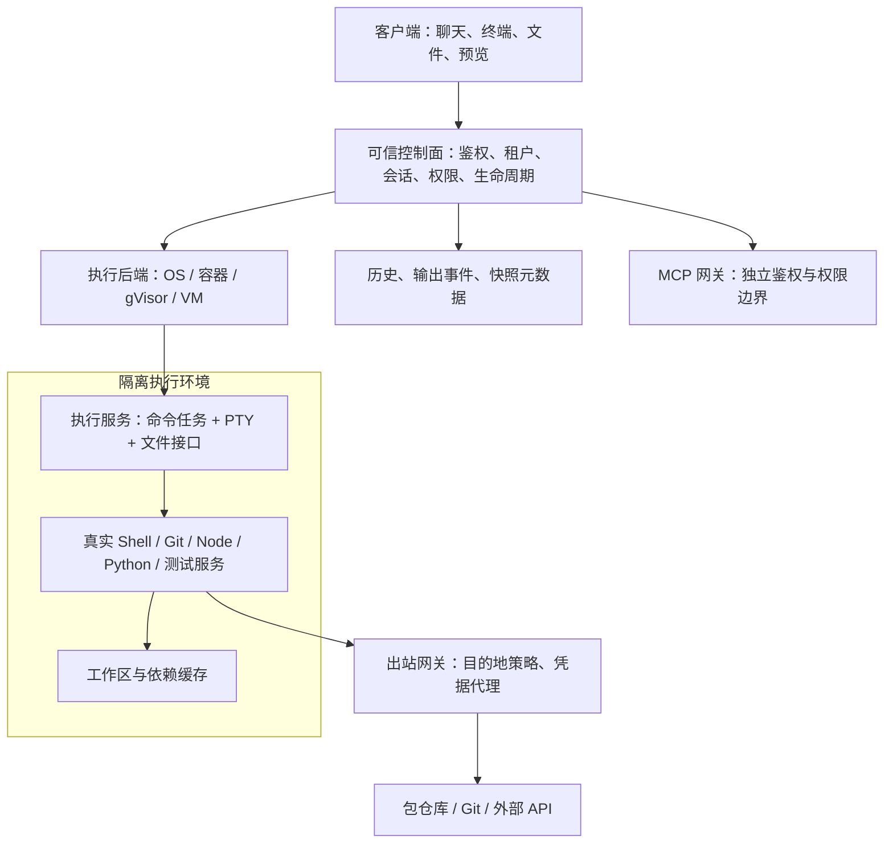

# Agent 终端沙盒：实现机制、主流方案与 Aether 接入建议

核对日期：2026-10-08。范围：Claude Code / Anthropic sandbox-runtime、Codex、本地 Docker Sandboxes、OpenHands、E2B、Daytona、Modal、Vercel Sandbox，以及 Aether 引擎和客户端当前执行路径。

结论：成熟方案通常让 Agent 使用完整的 shell、Git、Node、Python、编译器和测试工具，再由操作系统、容器运行时或虚拟机执行访问限制。终端组件、命令审批和隔离运行时承担不同职责。仅检查命令字符串、限制 cwd、隐藏目录、提供几个内置命令，都不能证明任意子进程已受到隔离。

本报告依据本次实际读取的官方文档和公开源码；没有部署这些服务，没有进行性能、安全攻击或云账号配额实测。以下涉及 Aether 的结论是源码采样，工作树有并行开发，不能替代最终构建和部署验收。当前在线文档也不能作为本机 Claude 2.1.266 的完整功能清单。

**一、先分清四层能力**

| 层 | 解决什么 | 典型技术 |
| --- | --- | --- |
| 终端显示 | 光标、颜色、滚动、选区、复制粘贴、窗口尺寸 | xterm.js |
| 终端与命令执行 | 创建 shell、输入输出、退出码、取消、交互程序 | PTY / ConPTY、进程执行 API |
| 安全边界 | 进程能访问哪些文件、网络、设备和宿主资源 | Seatbelt、namespace、权限令牌、容器、gVisor、VM |
| 沙盒平台 | 调度、租户、镜像、生命周期、持久化、重连、计费 | E2B / Daytona / Modal / 自建控制面 |

PTY 是交互通道，不是安全边界。SSH 是远程连接方式，也不自动隔离远端 shell。Docker 镜像是环境打包格式；E2B 和 Vercel 接受镜像并不意味着它们最终只运行普通共享内核容器。Code OSS 是编辑器服务，终端沙盒不必以安装 Code OSS 为前提。

Agent 在隔离环境中运行 `npm install`，安装脚本及其创建的 Node、Python、shell 子进程也应该继承边界。只检查顶层命令是否叫 npm，无法约束依赖脚本随后执行什么。网络同理：给 HTTP 工具加域名检查，不能约束另一个 shell 进程自己建立 socket。

**二、主流方案的真实实现**

| 方案 | 已核实的隔离机制 | 对接特点与实际边界 |
| --- | --- | --- |
| Claude Code 内置沙盒 | macOS Seatbelt；Linux / WSL2 bubblewrap 与代理 | 完整 shell，文件/网络由系统约束；内置 Bash 边界不自动覆盖 MCP、Hooks、全部文件工具。当前产品文档称 native Windows 命令不受该内置沙盒保护。[1] |
| Anthropic sandbox-runtime | 可包住整个命令或 Agent 进程；Windows 新增 alpha 后端 | 固定源码 0.0.79：Windows 专用用户、NTFS ACL、WFP、受限令牌、Job Object；需要一次管理员安装。不能推断 Claude 2.1.266 已集成。[2] |
| Codex 本地 | macOS Seatbelt；Linux / WSL2 bubblewrap；Windows 原生权限隔离 | Windows preferred 模式用专用低权限用户、文件权限和防火墙；fallback 用受限令牌和较弱的环境级离线限制。审批与隔离分开。[3] |
| Codex Cloud 当前环境 | 每个任务一个 VM | 环境准备、任务状态保存、网络访问策略；network secrets 在代理处替换占位符。旧版容器文档不能代表当前所有云环境。[4] |
| Docker Sandboxes 当前本地产品 | 每个 sandbox 一个独立 Linux microVM | `sbx` CLI，独立 Docker daemon、宿主出站代理、凭据代理、可选工作区挂载或私有 clone。Windows 11 要求 Windows Hypervisor Platform；不要求安装 Docker Desktop/Engine。[5] |
| OpenHands | Docker 模式把 Agent Server 放在容器中 | 完整命令和工具服务；当前 Canvas 可每会话一个加固容器。Process 模式官方明确没有隔离。挂载工作区仍能修改宿主对应文件。[6] |
| E2B | 每个 sandbox 一个 Firecracker microVM | VM 内 envd 提供命令、PTY、文件、watcher、端口转发；控制面与节点 orchestrator 管理实例。当前公开 Embed 需要 Linux/KVM，定位评估部署。[7] |
| Daytona | 默认 Linux container；另有 Linux/Windows VM class | 当前公开 BYOC runner 使用 Docker/Sysbox，控制面仍由 Daytona Cloud 提供；容器和 VM 的暂停、快照能力不同。未证实 VM class 的具体 hypervisor。[8] |
| Modal | 可选 gVisor 或独立 Linux 内核的 VM | 结构化进程执行、镜像和卷；当前 GPU Sandbox 仅支持 gVisor。不同 runtime 的兼容性与性能需实测。[9] |
| Vercel Sandbox | Firecracker microVM | 完整 Linux 环境、命令、预览、镜像/文件快照；当前默认为持久沙盒，停止后保存文件系统，下次操作恢复；不等于恢复所有运行中进程。[10] |

Claude 的版本边界尤其重要。本次在线文档包含 2.1.271、2.1.284、2.1.285 行为；独立 sandbox-runtime 固定提交为 `3f0bad7345238f47736435e3f2b064399c1cad74`，package 标记 0.0.79、Windows alpha。以上两组事实均不能证明本机 `C:\Users\wb.xielin02\AppData\Roaming\Wuzu Client Dev\cli-binaries\claude\2.1.266` 已具有相同集成能力。本次没有重新运行该二进制进行隔离验收。

默认配置也影响结论：Claude 当前文档说明内置 sandbox 默认关闭；开启后的默认文件读取范围仍较广，环境变量会继承，敏感目录与凭据要另设规则。不能把“支持 OS 沙盒”理解为“默认不读取任何宿主凭据”。Codex Windows 的 `elevated` 名称涉及管理员批准的安装和策略配置，实际命令使用较低权限的沙盒用户，并不是让 Agent 以管理员权限执行。[1][3]

**三、四种底层路线为什么不同**

OS 级进程沙盒适合桌面产品。它复用已安装的开发工具，启动成本通常较低。macOS Seatbelt 为进程施加文件和网络规则；Linux bubblewrap 用 namespace、只读/可写挂载等机制构造进程视图；Windows 可以组合专用账户、ACL、受限令牌、Job Object 和防火墙/WFP。缺点是平台差异大，用户目录工具、证书、管理员安装及权限恢复会带来兼容问题。

普通 Linux 容器主要组合 namespaces、cgroups、capabilities、seccomp，以及可选 AppArmor/SELinux。[11] 容器通常共享宿主内核，需要明确非 root、资源限制、挂载和网络策略。给容器挂宿主 Docker socket 或大量宿主目录，会扩大它能控制的范围。把整套引擎装进一个容器，也不等于不同用户的命令已相互隔离。

gVisor 在用户态实现应用内核，由它处理大量应用系统调用，减少应用直接触达宿主内核的接口；`runsc` 兼容 OCI，可用于 Docker/Kubernetes。[12] 它不是简单的命令黑名单，也不是每个实例独立完整 Linux 内核的硬件 VM。某些系统调用、文件系统、调试器或高 syscall 负载需要兼容与性能验证。

microVM 为实例提供独立 guest kernel，由虚拟化边界约束访问。Firecracker 基于 Linux KVM，缩小虚拟设备面，适合大量短期隔离环境。[13] 平台仍要自己解决镜像、快照、网络、存储、调度和宿主补丁；使用 microVM 也不代表不存在漏洞。Firecracker 的最小启动指标不能直接当作“项目 clone、安装依赖、Agent 就绪”的耗时。

Windows 上运行 Linux microVM 与运行原生 Windows 工具是不同需求。Linux 沙盒可运行 Bash/npm/Python，却不能保证 Windows SDK、COM、桌面 GUI 工具或所有 PowerShell 脚本可用。产品必须明确实际 OS、shell 和运行位置。

**四、一套真正可用的 Agent 终端沙盒如何连接**

Agent 编排既可以在可信控制面运行、通过 API 调用沙盒，也可以连同 Agent Server 一起运行在沙盒内。前一种便于集中保管服务密钥；后一种更容易让本地文件工具、Hooks、技能脚本继承统一进程边界。两种都需要盘点绕过执行服务的其他路径。

通常应复用一个任务或工作区的环境，再在其中启动多个命令或 PTY。若每条命令都创建空环境，安装依赖、后台服务和环境状态很难连续使用。也不能让互不信任的租户共用一个容器，只靠不同 cwd 区分。

需要独立管理这些标识：

- `tenantId`：所有权和权限归属。
- `workspaceId`：代码与文件归属；多个会话共享时，文件改动也会共享。
- `sessionId`：聊天历史与任务上下文。
- `sandboxId`：实际执行环境及其生命周期。
- `commandId` / `terminalId`：一次命令任务或一个交互 shell。
- `connectionId` / 输出游标：某次连接，不应当作进程身份。

Agent 命令最好返回结构化 `stdout/stderr/exitCode/status`，支持超时、取消和持续输出。交互终端则要支持 stdin、PTY resize、信号、交互程序和终端控制序列。两者共用运行环境，不必共用同一条 shell 输入流，否则用户与 Agent 同时输入可能相互打断。

关闭终端面板通常只断开显示连接；结束 shell、停止沙盒、暂停沙盒、删除工作区分别是不同操作。WebSocket 断线后应按原 terminalId 重连、补读输出、同步行列数。普通 PTY 字节流不能天然保证输入恰好执行一次，断线时不能盲目重发上一段命令。

**五、文件、网络、密钥、资源和持久化如何落实**

| 维度 | 实现要点 | 不能混淆的概念 |
| --- | --- | --- |
| 文件 | 工作区显式挂载；基础镜像只读或可恢复；tmp/home/缓存分离；路径和符号链接约束 | 可写挂载里的源码仍可被删除；隔离不等于撤销或备份 |
| 网络 | 在隔离边界限制直接出网，再通过网关允许所需目的地 | 只设置 HTTP_PROXY 可以被程序忽略；namespace 本身不等于域名白名单 |
| 密钥 | 环境白名单、最小权限凭据、按目的地代理注入、日志脱敏 | 把密钥放进 env 后，环境中的进程通常能读取它 |
| 资源 | CPU、内存、PID、磁盘、输出、进程时限、总寿命和空闲策略 | 进程 timeout、连接 timeout、sandbox TTL 是不同计时器 |
| 状态 | 文件卷、数据库历史、镜像缓存、文件快照和内存快照分开管理 | 有文件快照不等于后台服务和 TCP 连接还能继续 |
| 预览 | 端口代理、所有权校验、访问令牌、到期策略 | 知道 URL 才能访问不等于身份鉴权 |

完整开发环境必须能够获取依赖。可以预制常用工具镜像，安装阶段允许项目所需 registry/Git/下载站点，执行阶段按策略缩小网络范围。`network=none` 是有效隔离选择，但未预装依赖时不能同时承诺 npm/pip/git 在线安装可用。域名规则要覆盖依赖实际使用的 CDN、重定向目标和私有源，并提供可理解的失败原因。

当前多家提供商默认允许公网出站，不能根据“有沙盒”三个字推定默认断网：E2B 默认可出网；Modal 默认可连接公网 IP；Vercel 默认 `allow-all`。Daytona 的有效策略还受到组织 tier 约束。使用方必须显式设置策略。[7][8][9][10]

域名过滤也有层次。按 TLS SNI 过滤不一定检查加密后的 HTTP Host；Vercel 和 Modal 的当前文档明确讨论 domain fronting。域名级 allowlist 不等于 URL 路径、账户或 API 操作级授权。若需要限定凭据只能调用某些服务接口，应在能检查请求的代理层继续限制，避免宽泛的 CIDR 放行绕开域名规则。

Docker Sandboxes 和当前 Codex Cloud 都有值得参考的凭据代理机制：沙盒进程看到占位符，代理在允许的外部请求中替换成真实密钥。[4][5] 这种方式减少原始密钥进入沙盒的机会，但沙盒仍能使用被授权的接口，不能将其理解为没有权限滥用风险。

**六、生命周期上最容易照搬出错的地方**

| 实例 | 当前官方行为 | 接入时必须处理 |
| --- | --- | --- |
| E2B PTY | 默认 SDK session timeout 60 秒；可设 0；disconnect 可保留 PTY 进程 | 不能将 SDK 的连接/执行等待超时显示为整个 sandbox 被删除 |
| E2B pause / snapshot | 可保存文件和内存；snapshot 会中断活动连接 | 恢复连接与进程状态分别处理；paused 保存期限和连续运行额度是不同限制 |
| Daytona container | start/stop/archive；文件快照；不支持 VM 式 pause/fork/内存快照 | 不能给所有 class 显示相同“恢复运行中进程”承诺 |
| Daytona container idle | 默认闲置 15 分钟 auto-stop，内部有进程也可能触发 | 长构建需要显式配置空闲策略，不能只依赖进程仍在运行 |
| Docker sbx | stop/restart 保留环境；remove 删除 VM 内容；直接挂载的工作区在宿主 | 删除沙盒与删除项目数据分别设计；clone 与 direct mount 语义不同 |
| Vercel 当前持久沙盒 | stop 保存文件系统；下次操作可自动启动新的 session | 重新启动服务，不能把文件恢复当作内存级恢复 |

这些是读取日期的厂商文档行为；SKU、地区、组织策略和版本可能进一步限制。不要把一个 SDK 示例里的 `timeout: 0` 当作跨厂商统一的无限寿命语义。

**七、MCP、Skill 与“全部 Agent 能力”的边界**

Claude 当前文档直接区分内置 Bash 沙盒与整个 Agent 的外层隔离。本地 MCP、Hooks、LSP、部分辅助进程及文件/Web 工具各有自己的执行和权限路径；内置 Bash 配置不自动覆盖它们。[1] 如果需要整个进程树受约束，可用独立 sandbox-runtime 包住 Agent，或把相关执行部分放入容器/VM。

Docker Sandboxes 的 MCP gateway 在宿主侧。其本地 stdio MCP 服务也运行在宿主，MCP 策略与 HTTP 出站代理策略分别执行。[5] 因此即使 Agent 在 microVM 内，也要追踪它通过工具获得了哪些沙盒外能力。

对 Aether，技能 Markdown 的导入、保存和提示注入，与执行技能附带脚本应当分层；脚本必须选择受控执行后端。MCP JSON 描述可以保存，但服务器启动、发现工具、调用工具都要有明确的运行位置和环境变量范围，不能等到 callTool 才检查前面已经启动的进程。远程 MCP 自有权限和外部副作用，不会被本地 shell 沙盒自动撤销。

**八、Aether 当前源码与成熟方案的差距**

采样对象：`D:\dev\ai-agent-engine` 与 `D:\dev\aether-code`。约 2026-10-08 14:43 的审计快照；并行任务正在继续修改 runtime，不把中途状态写成最终缺陷或最终交付。

| 路径 | 采样实现 | 能说明什么 |
| --- | --- | --- |
| 客户端本地终端 | node-pty 直接启动宿主 PowerShell/pwsh/bash，继承客户端环境 | 是用户的本机终端；不能标成 OS 沙盒 |
| 引擎远端交互终端 | 已有受限工作区文件 shell；新 Docker provider 已开始接线 | 文件 shell 与 Linux 容器是两种运行能力，UI 应区分 |
| Agent execute_cmd / run_command | 策略预检后交给 command-jobs，采样时仍直接 host spawn | 命令审批和进程树取消已存在；不能据此声称有 CPU/内存/文件系统隔离 |
| Skill 脚本 | safe 模式限制；其他模式存在直接 exec 路径 | 需要进入同一执行后端，不能漏掉子进程 |
| MCP stdio | 宿主 spawn；工具发现会触发 connect | 必须同时审视启动/发现路径和调用路径 |

采样时新增 `workspace-runtime.ts` 已有真实 Docker create/start/cleanup 代码：Linux daemon、本地镜像 digest、仅挂载工作区、非 root UID/GID 10001、根文件系统只读、cap-drop ALL、禁止提权、断网、2 CPU / 1 GiB / 256 PID，以及按 ownership label 清理。不是空接口。与此同时，该次采样仍有交互终端异步 API 接线待完成，Agent 命令管理器尚未使用 provider，新 runtime 尚未出现在 dist 中；故只能标记为开发中，不能标记为已部署验收。

目前最有价值的差距是执行路径统一、真实 shell 的依赖安装能力、环境复用、可配置网络与凭据、完整生命周期，以及覆盖 Skill/MCP 的边界。继续扩大命令黑名单，不会补齐这些平台能力。

源码定位（供后续实施时重新核对）：

- `aether-code/src/main/terminal/pty-service.ts`：宿主 shell 与环境。
- `aether-code/src/main/ipc.ts`：embedded / remote 终端分流。
- `ai-agent-engine/src/runtime/workspace-runtime.ts`：新增执行提供器。
- `ai-agent-engine/src/terminal/index.ts`：交互终端创建。
- `ai-agent-engine/src/api/http/routes/terminal.ts`：终端 HTTP API。
- `ai-agent-engine/src/core/command-jobs/manager.ts`：Agent 命令实际 spawn。
- `ai-agent-engine/src/tools/skill/run-skill-script.ts`：技能脚本执行。
- `ai-agent-engine/src/tools/mcp/client.ts`：MCP 进程启动、工具发现、调用。
- `ai-agent-engine/src/security/guarded-http.ts`：HTTP 工具网络保护，不是所有进程网络隔离。

采样指纹：runtime SHA256 `BB6866AAC6DC00E1F3D8586ADF41CE8CB456C899B389EAAA438A2CA79263EF6F`；terminal manager `6B803CBE22F0B0491151081FDA48E4D4DBFBD30F7B0009346DF63E8C33C3F999`；Agent command manager `853E7FA8B7DB53D2CA52292309FAFD4B99C54F891031B252B22647512DFEA917`。后续文件若变化，应重新审计，不套用这些结论。

**九、结合我们产品的实施优先级建议**

以下是架构建议，本次没有实施，也没有对任一厂商宣称价格或性能最优。

1. 先统一执行接口。保留 xterm UI，让交互终端、Agent 命令和 Skill 脚本使用同一 runtime/session 管理；增加能力声明，明确 OS、shell、网络、可写路径、工具可用性和持久化方式。MCP 根据其部署位置纳入该 runtime 或独立网关策略。
2. 完成一个可用的 Linux 开发环境。现有 Docker provider 是成本较低的第一步：复用任务环境、预装 Git/Node/Python、处理可写缓存与依赖目录，允许受控安装，接好命令、PTY、文件和预览入口。普通容器的安全边界应如实显示，并为多租户隔离保留增强路径。
3. Windows 客户端明确提供运行位置选择。宿主终端保留 Windows 开发能力并明确显示本机执行；Linux 容器/WSL2/远端沙盒提供相应开发环境。Docker sbx 可作为 Windows microVM 候选独立验证：当前要求 Win11/WHP、Docker 登录，有自己的生命周期与集成方式，不能直接等同现有 Docker CLI provider。
4. 多用户远端再选择 gVisor / microVM / 托管 provider。已有 Linux 容器运维能力时可验证 gVisor；需要独立内核、镜像和内存快照时评估 Firecracker/E2B。最短接入路线通常是使用厂商 API，但需比较实际地区延迟、数据路径、SDK能力、组织额度和长期成本。
5. Windows 原生命令若也必须隔离，单独做 Windows 后端。参考 Codex 专用用户方案和 srt alpha 源码，验证 ACL 恢复、系统代理、证书、工具路径、多会话权限与进程清理。不能用 Linux 沙盒的成功测试替代这一阶段。

自托管选择不能沿用旧文章：Daytona 原核心公开仓库已在 2026 年 6 月公告停止维护、核心开发转私有；当前 BYOC 仍用厂商控制面。E2B 当前 runtime 开源 Apache-2.0，Embed 是 Linux/KVM 单机评估入口，官方明确不是生产部署模式。两者均需按当前文档和许可重新评估。[7][8]

产品交互应把“缺什么”变成可操作的信息：显示缺失运行时、未配置镜像、镜像内缺少工具、目标域名被拒绝、工作区不可写、沙盒已停止等具体状态，并提供对应设置入口。后端没有启动成功时应保持失败状态，不能悄悄用普通宿主 shell 完成同一命令却继续显示“已隔离”。

**十、后续真正验收应覆盖什么**

这是一份测试设计，下面所有项目均不表示本轮已执行。

| 场景 | 应观察到的结果 |
| --- | --- |
| 正常重度开发 | clone、安装依赖、编译、测试、启动服务、curl、读写文件、多个终端均可完成 |
| Agent 与手动终端协作 | 使用同一工作区和环境，独立任务流；取消一个任务不误杀其他终端 |
| Skill 与 MCP | 技能脚本继承选定边界；MCP 启动和调用的权限范围均与 UI 一致 |
| 文件负面验证 | 对允许目录外的读写、符号链接、路径穿越、用户密钥目录访问按声明规则被拒绝；测试在隔离夹具中进行 |
| 网络负面验证 | 原始 socket、去掉代理环境变量、重定向、DNS、IPv6、私网/元数据、受控 host 服务分别符合策略 |
| 资源与取消 | 超时、超内存、PID/输出/磁盘限制能生效；取消清理后代进程，不影响引擎控制面 |
| 连接与显示 | 断网/重连、关闭面板、切换会话、调整尺寸、复制粘贴不丢进程状态、不盲重放输入 |
| 持久化 | 文件保存、停机恢复、内存恢复分别按 provider 承诺验证；不虚构不存在的能力 |
| 多租户和预览 | 不能用他人的 sandboxId/terminalId/预览 URL 越权，端口代理验证所有权 |
| 失败与清理 | 依赖缺失、镜像缺失、daemon 停止、崩溃重启不静默降级；清理只处理本产品持有的资源 |

验证性价比应测端到端：首次准备时间、热启动时间、真实项目安装/编译时长、交互延迟、峰值内存、闲置成本、磁盘增长和清理时间。网络延迟和包缓存通常会明显影响体验，不能只比较 VM 开机速度。

**资料与证据索引**

以下均为本次实际读取的官方页面或官方源码；公开网页可能继续更新。

1. Claude：[内置 sandboxing](https://code.claude.com/docs/en/sandboxing)、[隔离环境比较](https://code.claude.com/docs/en/sandbox-environments)。
2. Anthropic：[固定 sandbox-runtime 提交](https://github.com/anthropic-experimental/sandbox-runtime/tree/3f0bad7345238f47736435e3f2b064399c1cad74)、[Windows 实现](https://github.com/anthropic-experimental/sandbox-runtime/blob/3f0bad7345238f47736435e3f2b064399c1cad74/src/sandbox/windows-sandbox-utils.ts)。
3. Codex：[Sandboxing](https://learn.chatgpt.com/docs/sandboxing)、[Windows sandbox](https://learn.chatgpt.com/docs/windows/windows-sandbox)、[审批与安全](https://learn.chatgpt.com/docs/agent-approvals-security)。
4. Codex：[当前 Cloud environments](https://learn.chatgpt.com/docs/environments/cloud-environments)、[Legacy cloud environment](https://learn.chatgpt.com/docs/environments/cloud-environment)。当前与 legacy 分开引用。
5. Docker：[Sandboxes 架构](https://docs.docker.com/ai/sandboxes/architecture/)、[隔离层](https://docs.docker.com/ai/sandboxes/security/isolation/)、[安装与平台要求](https://docs.docker.com/ai/sandboxes/install/)。
6. OpenHands：[每会话 Docker](https://docs.openhands.dev/openhands/usage/agent-canvas/backend-setup/docker-execution)、[Docker Sandbox](https://docs.openhands.dev/openhands/usage/sandboxes/docker)、[Process Sandbox](https://docs.openhands.dev/openhands/usage/sandboxes/process)、[SDK DockerWorkspace](https://docs.openhands.dev/sdk/guides/agent-server/docker-sandbox)。
7. E2B：[runtime](https://github.com/e2b-dev/runtime)、[架构](https://github.com/e2b-dev/runtime/blob/main/docs/ARCHITECTURE.md)、[Embed](https://github.com/e2b-dev/runtime/tree/main/embed)、[PTY](https://docs.e2b.dev/sandbox/pty)、[持久化](https://docs.e2b.dev/sandbox/persistence)、[快照](https://docs.e2b.dev/sandbox/snapshots)、[网络](https://docs.e2b.dev/network/internet-access)、[公开入口鉴权](https://docs.e2b.dev/network/restrict-public-access)。
8. Daytona：[Sandboxes](https://www.daytona.io/docs/en/sandboxes/)、[架构](https://www.daytona.io/docs/en/architecture/)、[PTY](https://www.daytona.io/docs/en/pty/)、[网络](https://www.daytona.io/docs/en/network-limits/)、[BYOC](https://www.daytona.io/docs/en/bring-your-own-compute/)、[BYOC chart](https://github.com/daytonaio/helm-charts/tree/main/charts/daytona-region)、[原核心仓库公告](https://github.com/daytonaio/daytona)。
9. Modal：[Sandboxes](https://modal.com/docs/guide/sandboxes)、[网络策略](https://modal.com/docs/guide/sandbox-networking)。
10. Vercel：[Sandbox 概念与架构](https://vercel.com/docs/sandbox/concepts)、[Firewall](https://vercel.com/docs/sandbox/concepts/firewall)。
11. Docker Engine：[安全机制](https://docs.docker.com/engine/security/)。
12. gVisor：[架构文档](https://gvisor.dev/docs/)。
13. Firecracker：[官方项目](https://firecracker-microvm.github.io/)。

原文和细分笔记保存在 `D:\dev\ai-agent-engine\.tmp\research-agent-sandbox`，包括 Claude 固定源码、厂商 Markdown、HTTP 页面和两份子研究笔记。失效页面未作为结论依据。OpenHands 旧架构页引用的部分 main 源码已 404，改用当前 V1 / Agent Canvas 文档核对；未把历史源码误写成现行实现。
