# Security & Sandbox Architecture

> Agent Engine 安全与沙盒体系完整架构文档
> 面向使用者与集成开发者

---

## 整体架构概览

```
+------------------------------------------------------------------+
|                         用户请求入口                                |
+------------------------------------------------------------------+
         |
         v
+------------------+     +-------------------+     +----------------+
|   认证层 (Auth)   | --> |  策略引擎 (Policy) | --> |  执行层 (Tool)  |
+------------------+     +-------------------+     +----------------+
                               |                         |
                               v                         v
                    +--------------------+     +-------------------+
                    |  审计日志 (Audit)   |     | 沙盒环境 (Sandbox) |
                    +--------------------+     +-------------------+
```

整个安全体系采用 **纵深防御** 设计，共 7 个模块协同工作，任何一层被绕过仍有下一层拦截。

---

## 模块 1：认证中间件 (Auth)

**路径**: `src/auth/`

**职责**: 验证请求身份，提取租户信息，为后续模块提供上下文。

### 架构图

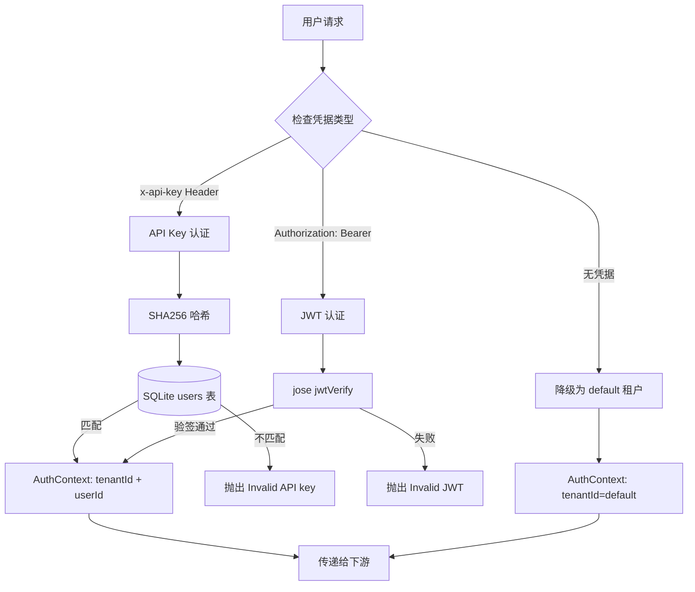

### 关键接口

```typescript
interface AuthContext {
  tenantId: string       // 租户 ID（隔离依据）
  userId?: string        // 用户 ID
  method: 'api-key' | 'jwt' | 'none'
  roles?: string[]       // 角色列表（预留）
}

interface AuthMiddleware {
  authenticate(request): Promise<AuthContext>
}
```

### 配置项

| 环境变量 | 默认值 | 说明 |
|----------|--------|------|
| `JWT_SECRET` | `dev-secret-change-in-production` | JWT 签名密钥 |
| `AUTH_ENABLED` | `true` | 设为 `false` 则跳过认证 |

### 安全要点

- API Key 存储使用 SHA256 单向哈希，数据库不存明文
- JWT 使用 `jose` 库验签，支持标准 claims
- 未携带凭据不报错（降级），但携带了无效凭据会立即拒绝

---

## 模块 2：策略引擎与细粒度审批 (Exec Policy)

**路径**: `src/security/policy-engine.ts`

**职责**: 对命令执行进行三级安全裁决（注入检测 → 路径穿越 → 规则匹配），并在必要时暂停执行流程以获取用户显式授权。

### 架构图

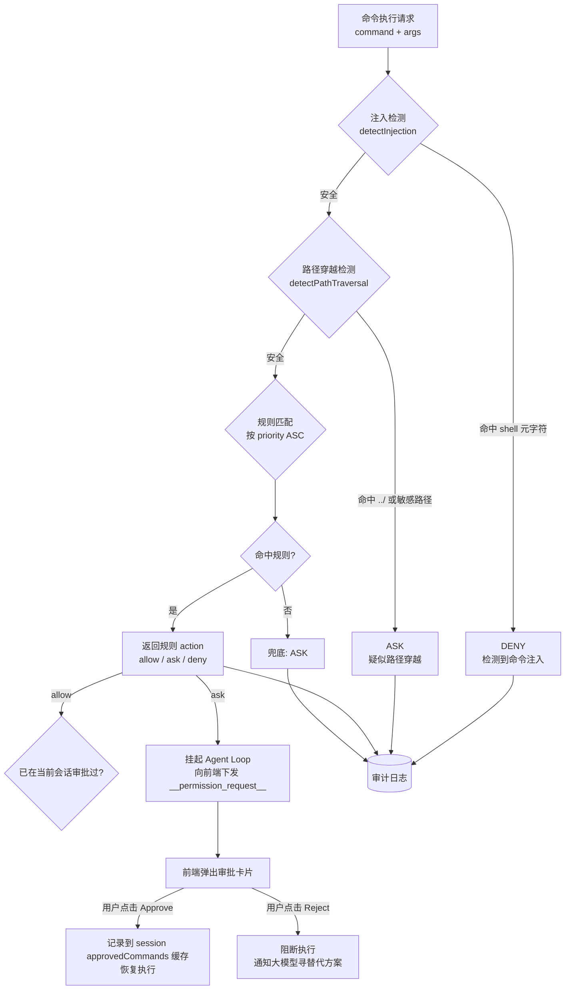

### 注入检测覆盖模式

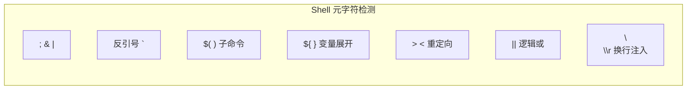

### 内置默认规则

| 优先级 | 命令 | 动作 | 说明 |
|--------|------|------|------|
| 5 | sudo | deny | 禁止提权 |
| 5 | shutdown / reboot | deny | 禁止关机重启 |
| 5 | format / mkfs | deny | 禁止格式化磁盘 |
| 10 | rm / del | ask | 删除需确认 |
| 20 | kill / taskkill | ask | 终止进程需确认 |
| 30 | chmod / chown | ask | 修改权限需确认 |
| 200 | ls / dir / cat / echo / grep / find / node / npm / npx | allow | 常用安全命令 |
| 999 | * (通配) | ask | 未知命令默认询问 |

### 规则自定义

规则持久化到 SQLite `security_policies` 表，支持：
- **CRUD 操作** — 新增 / 修改 / 删除 / 重置默认
- **优先级覆盖** — 数字越小越先匹配
- **参数正则** — `argPattern` 字段可对参数序列做细粒度匹配
- **开关控制** — `enabled` 字段可临时禁用规则

---

## 模块 3：命令白名单 (Command Whitelist)

**路径**: `src/security/cmd-whitelist.ts`

**职责**: 作为策略引擎之后的 **第二道关卡**，确保只有预定义的安全命令才能被 spawn 执行。

### 架构图

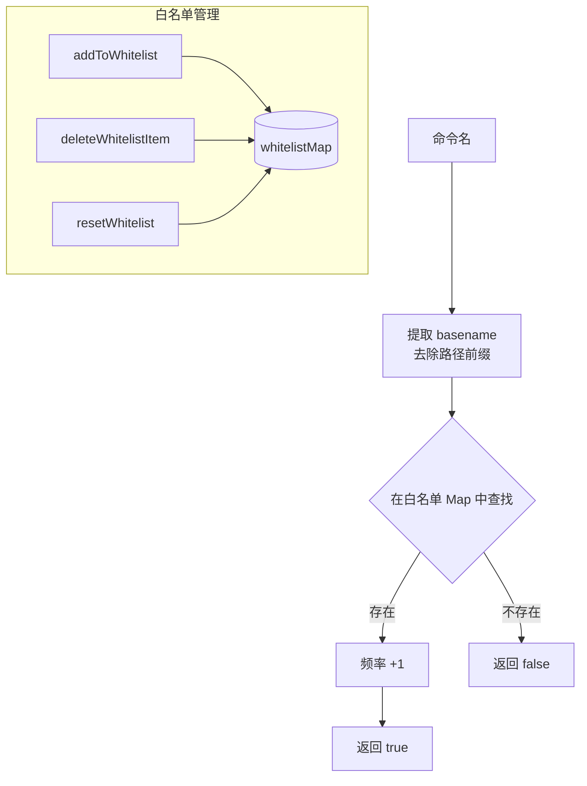

### 默认白名单

```
ls, dir, echo, cat, type, pwd, cd, find, grep, where,
date, time, whoami, hostname, node, npm, npx, wc
```

### 与策略引擎的关系

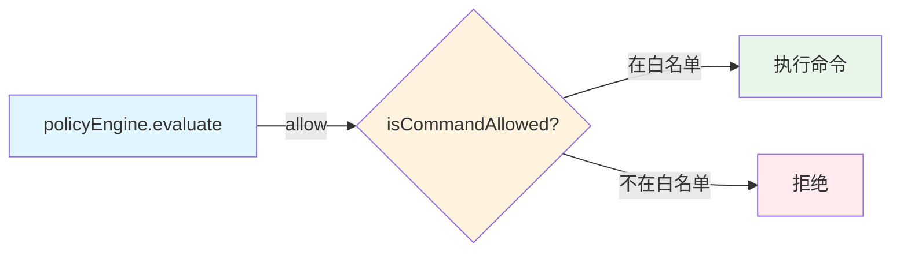

> 双重保护：即使策略引擎被绕过放行，白名单仍会拦截非预期命令。

---

## 模块 3.5：DevContainer 与系统级网络隔离

在物理隔离层，Aether Engine 提供了基于 `.devcontainer` 的完整容器化运行规范：

- **Docker Compose 隔离**：每个租户/会话可分配独立的 DevContainer，保证底层文件系统和进程空间与宿主机彻底隔离。
- **iptables / ipset 防火墙**：在 `init-firewall.sh` 中配置了底层的网络出站策略。默认丢弃所有非必须流量，仅对大模型 API（如 `api.openai.com`, `api.deepseek.com`, `dashscope.aliyuncs.com` 等）以及必要的包管理器服务（npm、pip）放行。
- 这一层不依赖 Node.js 的应用层检查，即使 Agent 成功诱导执行了 `curl` 或下载了恶意脚本，也会被内核级网络隔离拦截。

---

## 模块 4：网络策略 (Network Policy)

**路径**: `src/security/network-policy.ts`

**职责**: 对所有出站 HTTP 请求执行完整的 SSRF 防护链路检查。

### 架构图

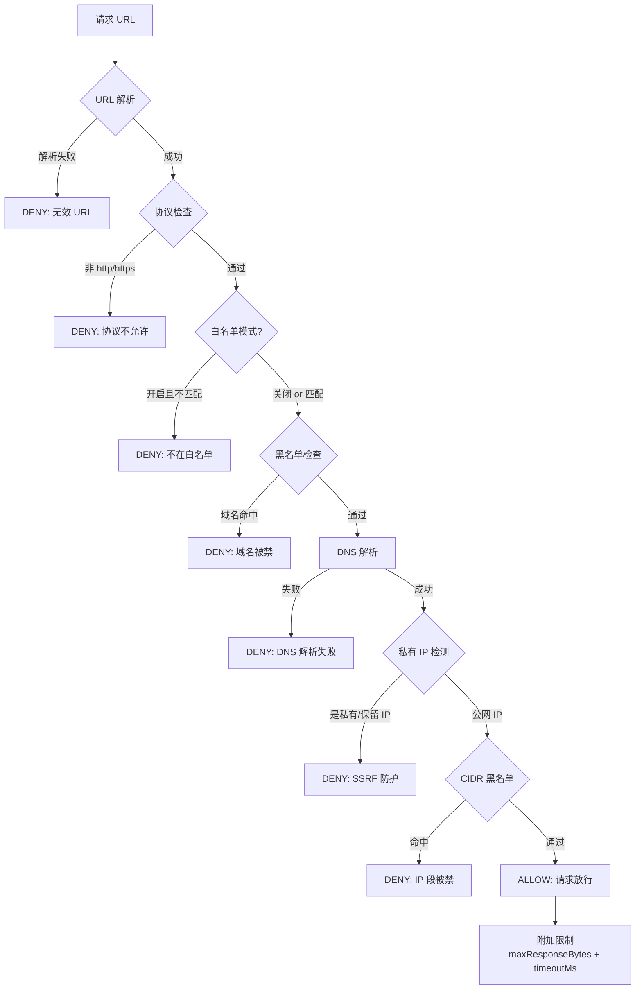

### 私有 IP 段覆盖

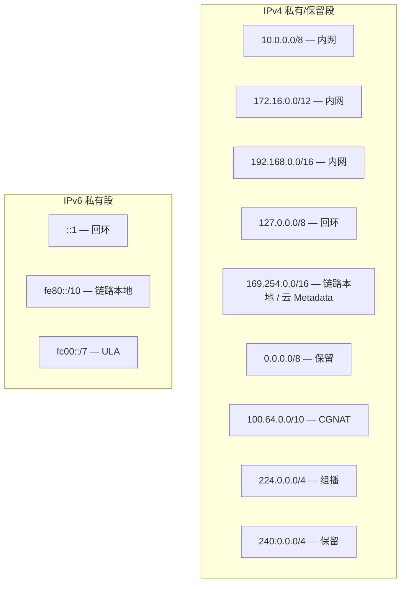

### 默认策略配置

```typescript
{
  allowedProtocols: ['https:', 'http:'],
  denyListEnabled: true,
  denyDomains: ['metadata.google.internal', 'metadata.aws.internal'],
  denyCidrs: [],
  allowListEnabled: false,
  allowDomains: [],
  blockPrivateIP: true,         // SSRF 核心开关
  dnsCacheTtl: 300,             // DNS 缓存 5 分钟
  maxResponseBytes: 5242880,    // 5MB 响应上限
  timeoutMs: 30000,             // 30 秒超时
}
```

### DNS 缓存机制

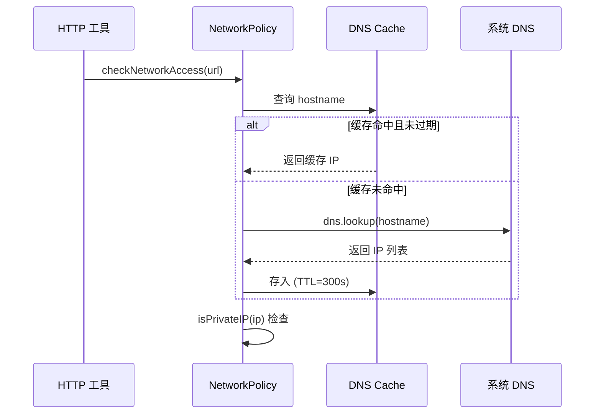

---

## 模块 5：文件系统沙盒 (Workspace Manager)

**路径**: `src/workspace/manager.ts`

**职责**: 按 租户+会话 维度隔离文件访问，防止路径穿越。

### 架构图

```mermaid
flowchart TD
    subgraph 文件系统布局
        ROOT[workspace root] --> T1[tenant-A/]
        ROOT --> T2[tenant-B/]
        T1 --> S1[session-1/]
        T1 --> S2[session-2/]
        T2 --> S3[session-3/]
    end
    
    REQ[文件操作请求<br/>userPath] --> ABS{绝对路径?}
    
    ABS -->|是| CHECK_ABS{遍历所有 bound workspace<br/>前缀匹配}
    CHECK_ABS -->|在范围内| OK[返回路径]
    CHECK_ABS -->|越界| ERR1[抛出: outside workspace]
    
    ABS -->|否 (相对路径)| RESOLVE[path.resolve(base, userPath)]
    RESOLVE --> CHECK_REL{resolved 以 base 开头?}
    CHECK_REL -->|是| OK
    CHECK_REL -->|否| ERR2[抛出: Path traversal detected]
```

### 多工作空间绑定

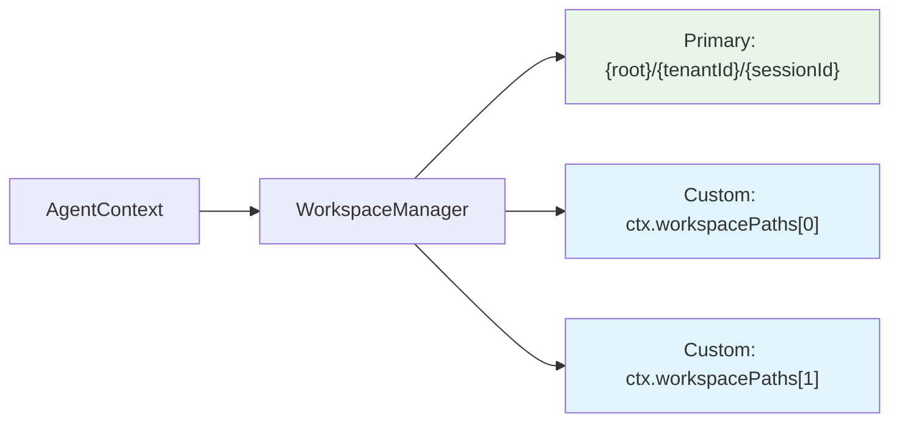

### 关键方法

| 方法 | 功能 |
|------|------|
| `getPaths(ctx)` | 返回会话绑定的所有工作区路径 |
| `getPath(ctx)` | 返回主工作区路径 |
| `init(ctx)` | 确保工作区目录存在，不存在则递归创建 |
| `resolveSafePath(ctx, userPath)` | 安全解析路径，越界抛异常 |
| `snapshot(ctx)` | 快照（P1 规划中） |
| `restore(path, ctx)` | 恢复快照（P1 规划中） |

---

## 模块 6：终端沙盒 (Workspace Shell)

**路径**: `src/terminal/workspace-shell.mjs` + `src/terminal/index.ts`

**职责**: 提供一个物理隔离的交互式 Shell，所有操作锁定在工作空间内。

### 架构图

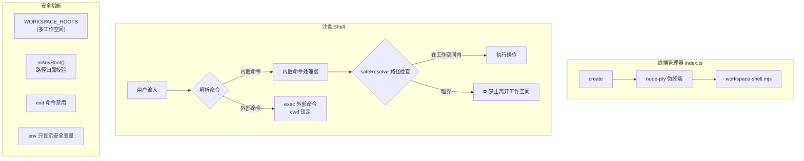

### 内置命令一览

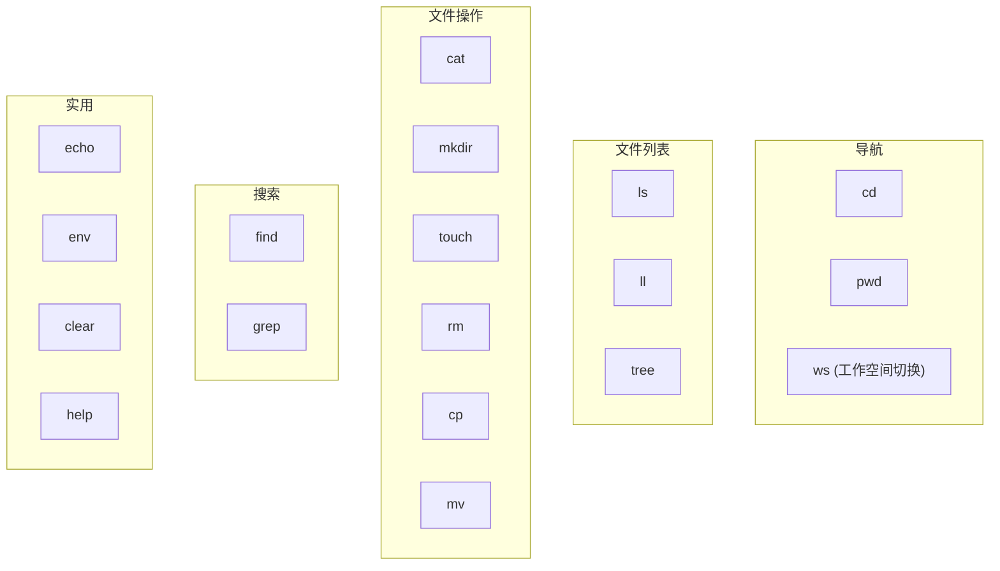

> 所有内置命令在执行前都调用 `safeResolve(target)` 验证路径合法性。

### 外部命令执行

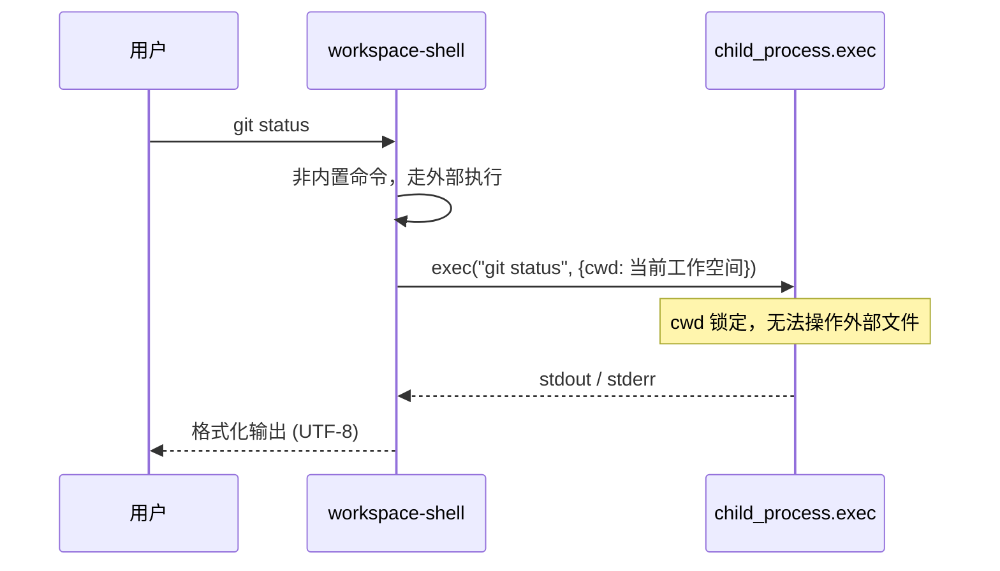

### 多工作空间支持

```
$ ws
绑定的工作空间：
  ~（主）   /project/workspace/tenant-1/session-abc  ◀ 当前
  @ws2      /home/user/custom-project

$ cd @ws2          # 切换到第二个工作空间
$ cd ~             # 回到主工作空间
$ cd ../../        # ⛔ 禁止离开工作空间
```

---

## 模块 7：审计日志 (Audit Log)

**路径**: `src/security/audit-log.ts`

**职责**: 记录所有安全决策，提供可追溯的审计链路。

### 架构图

```mermaid
flowchart TD
    subgraph 写入来源
        PE[策略引擎] -->|每次裁决| LOG
        NP[网络策略] -->|每次检查| LOG
        FS[文件系统操作] -->|按需| LOG
        LSP[LSP 扫描] -->|按需| LOG
    end
    
    LOG[(AuditLogStore)] --> DB[(SQLite<br/>security_audit_log)]
    
    subgraph 查询与维护
        QUERY[分页查询<br/>按 tenant/category/decision/time]
        PURGE[定期清理<br/>purgeOlderThan(days)]
    end
    
    DB --> QUERY
    DB --> PURGE
```

### 审计记录结构

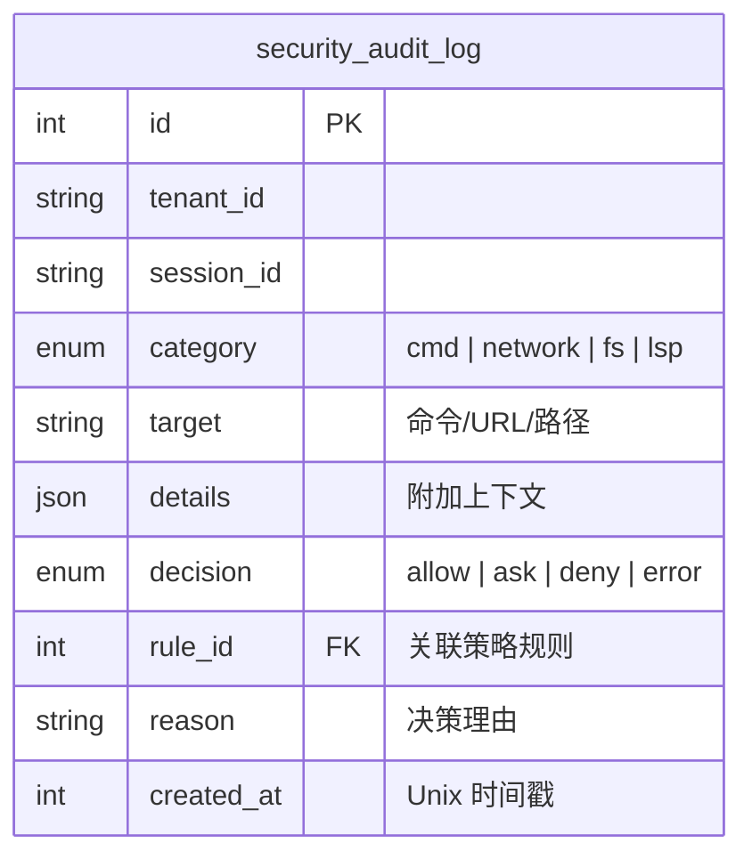

### 设计约束

| 约束 | 实现 |
|------|------|
| 写入不阻塞业务 | `try/catch` 包裹，失败仅 `console.warn` |
| 查询分页 | `limit` 最大 500，支持 `offset` |
| 时间范围过滤 | `since` 参数（Unix 秒） |
| 定期清理 | `purgeOlderThan(days)` 可由定时任务调用 |

---

## 模块间协作：完整数据流

### 命令执行流程

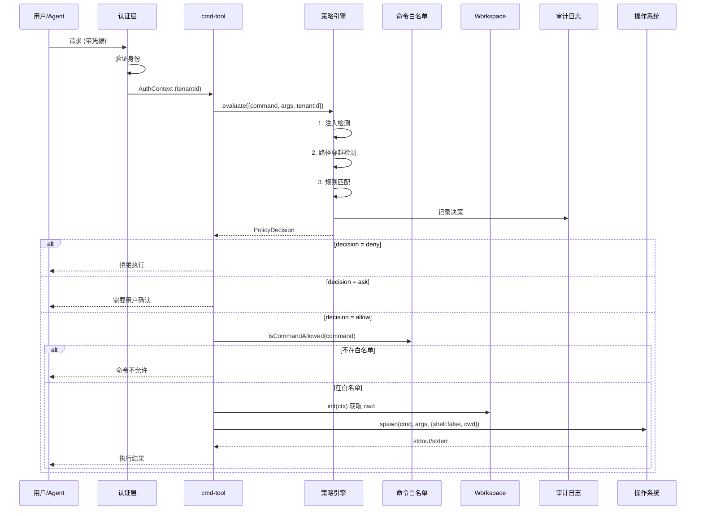

### 网络请求流程

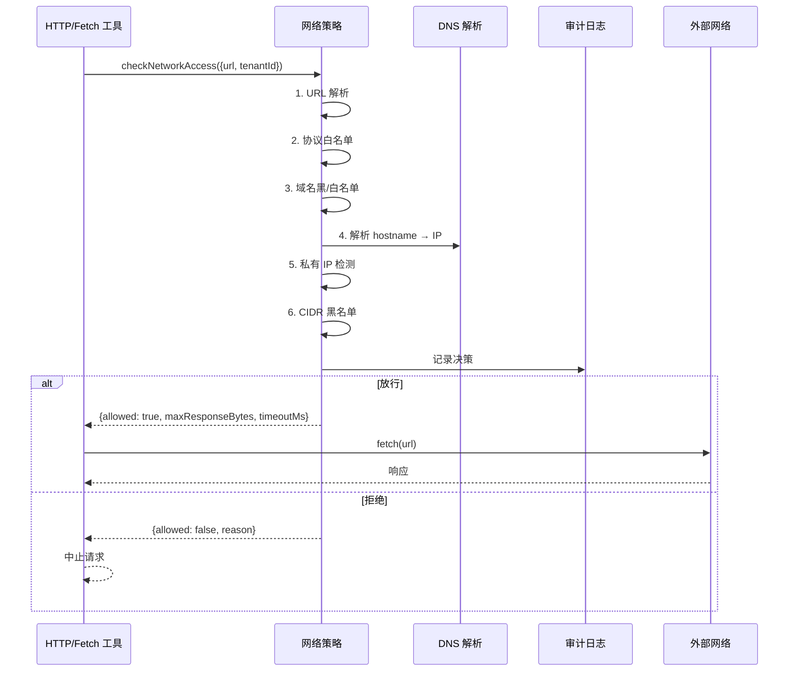

---

## 安全模式（会话级切换）

系统支持三种安全模式，用户可在前端输入框旁的下拉菜单中切换，也可通过 API 设置：

### 模式对比

| 维度 | 安全模式 (safe) | 标准模式 (standard) | 完全访问 (full-access) |
|------|----------------|--------------------|-----------------------|
| **命令注入检测** | deny | deny | 跳过 |
| **路径穿越检测** | ask 确认 | 自动放行 | 跳过 |
| **deny 规则** (sudo/shutdown等) | deny | deny | 跳过 |
| **ask 规则** (rm/kill等) | ask 确认 | 自动放行 | 跳过 |
| **命令白名单** | 检查 | 跳过 | 跳过 |
| **网络 SSRF 防护** | 全检查 | 跳过私有IP检测 | 全跳过 |
| **域名黑名单** | 检查 | 检查 | 跳过 |
| **审计日志** | 记录 | 记录 | 记录 |

### 切换方式

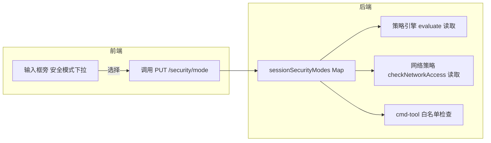

### API

```
GET  /api/v1/security/mode?sessionId=xxx
PUT  /api/v1/security/mode  { "sessionId": "xxx", "mode": "standard" }
```

### 设计要点

- **会话级别**：每个 session 独立模式，不影响其他用户/会话
- **切换即时生效**：无需重启，下一条命令立即应用新模式
- **切换写审计**：任何模式变更都记录到审计日志
- **full-access 需二次确认**：前端切换到完全访问时弹出确认对话框
- **默认 safe**：新会话总是以安全模式启动

---

## 安全设计原则

| 原则 | 实现方式 |
|------|----------|
| **纵深防御** | 7 层独立模块，任一层被绕过仍有后续拦截 |
| **最小权限** | 默认拒绝/询问，只有明确白名单才放行 |
| **零信任** | 每次操作独立评估，不信任历史状态 |
| **不可绕过** | shell:false + 路径前缀校验 + DNS 实际解析 |
| **可审计** | 所有决策留痕，支持事后追溯 |
| **容错** | 安全模块故障不崩溃主流程（审计降级警告） |
| **可配置** | 规则/策略存 DB，运行时可调整无需重启 |
| **租户隔离** | 文件系统物理隔离 + 审计按租户分类 |

---

## 快速配置指南

### 环境变量

```bash
# 认证
JWT_SECRET=your-production-secret     # 必须修改
AUTH_ENABLED=true                      # 生产环境必须 true

# 工作空间
WORKSPACE_ROOT=./workspace            # 工作空间根目录

# 命令执行
CMD_TIMEOUT_MS=5000                   # 命令超时毫秒数
```

### 自定义策略规则（通过 API）

```json
// POST /api/security/policies
{
  "name": "allow-docker",
  "command": "docker",
  "action": "allow",
  "priority": 50,
  "enabled": true,
  "description": "允许 Docker 命令"
}
```

### 自定义网络策略

```json
// PUT /api/security/network-policy
{
  "allowListEnabled": true,
  "allowDomains": ["api.openai.com", "github.com"],
  "blockPrivateIP": true,
  "maxResponseBytes": 10485760,
  "timeoutMs": 60000
}
```

---

## 数据库表结构

```sql
-- 策略规则表
CREATE TABLE security_policies (
  id INTEGER PRIMARY KEY AUTOINCREMENT,
  name TEXT NOT NULL,
  command TEXT NOT NULL,
  arg_pattern TEXT,
  action TEXT NOT NULL,        -- allow / ask / deny
  priority INTEGER DEFAULT 100,
  enabled INTEGER DEFAULT 1,
  description TEXT,
  created_at INTEGER DEFAULT (unixepoch()),
  updated_at INTEGER DEFAULT (unixepoch())
);

-- 审计日志表
CREATE TABLE security_audit_log (
  id INTEGER PRIMARY KEY AUTOINCREMENT,
  tenant_id TEXT NOT NULL DEFAULT 'default',
  session_id TEXT,
  category TEXT NOT NULL,      -- cmd / network / fs / lsp
  target TEXT NOT NULL,
  details TEXT,                -- JSON
  decision TEXT NOT NULL,      -- allow / ask / deny / error
  rule_id INTEGER,
  reason TEXT,
  created_at INTEGER DEFAULT (unixepoch())
);

-- 网络策略表
CREATE TABLE network_policies (
  id INTEGER PRIMARY KEY,
  config TEXT NOT NULL,         -- JSON
  updated_at INTEGER DEFAULT (unixepoch())
);
```
